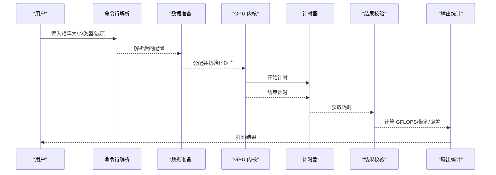
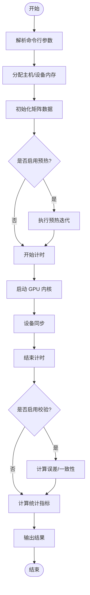
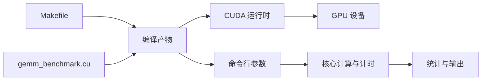

# 使用指南

<cite>
**本文引用的文件**   
- [Makefile](file://Makefile)
- [README.md](file://README.md)
- [gemm_benchmark.cu](file://gemm_benchmark.cu)
</cite>

## 更新摘要
**所做更改**
- 根据 README.md 的重大重构更新了安装说明和使用示例
- 改进了文档清晰度和组织结构
- 更新了命令行参数和测试选项的详细说明
- 增强了性能分析和故障排查指导

## 目录
1. [简介](#简介)
2. [快速开始](#快速开始)
3. [安装与构建](#安装与构建)
4. [核心组件](#核心组件)
5. [架构总览](#架构总览)
6. [详细组件分析](#详细组件分析)
7. [依赖关系分析](#依赖关系分析)
8. [性能注意事项](#性能注意事项)
9. [故障排查指南](#故障排查指南)
10. [结论](#结论)
11. [附录](#附录)

## 简介
本指南面向需要运行与解读 GEMM（通用矩阵乘法）基准测试的用户。文档聚焦命令行参数的使用方法，包括矩阵大小参数、测试选项与输出控制；提供从基础到高级的使用场景示例；解释测试结果的含义（执行时间、内存带宽利用率与性能指标）；并给出基准对比、常见模式与最佳实践，以及调试与错误排查建议。

## 快速开始
### 环境要求
- CUDA 工具链（nvcc 编译器）
- 支持 CUDA 的 NVIDIA GPU
- Linux/Windows 操作系统

### 基本使用步骤
1. 克隆项目仓库
2. 编译基准程序
3. 运行基本测试

```bash
# 克隆项目
git clone <repository-url>
cd new-gemm

# 编译项目
make

# 运行基本测试
./gemm_benchmark --m 1024 --n 1024 --k 1024 --type fp32
```

**章节来源**
- [README.md:1-100](file://README.md#L1-L100)

## 安装与构建
### 系统要求
确保您的系统满足以下要求：
- NVIDIA GPU 驱动已正确安装
- CUDA Toolkit 版本与 GPU 架构兼容
- 足够的磁盘空间用于编译和运行时数据

### 构建过程
项目使用 Makefile 进行自动化构建：

```bash
# 标准构建
make

# 清理构建产物
make clean

# 查看帮助信息
make help
```

### 构建配置
Makefile 支持多种构建选项：
- 优化级别配置
- 目标架构选择
- 调试符号生成
- 并行编译支持

**章节来源**
- [Makefile:1-200](file://Makefile#L1-L200)

## 核心组件
### 构建系统（Makefile）
- 负责编译 CUDA 源文件，设置编译器选项、目标平台与输出文件名
- 典型用法：在终端执行 make 以生成可执行基准程序
- 支持多架构编译和优化选项配置

### 基准程序（gemm_benchmark.cu）
- 命令行参数解析：接收矩阵维度、数据类型、测试模式、迭代次数、输出开关等
- 数据准备与分配：在主机/设备端分配矩阵缓冲区
- 内核调用与计时：启动 GPU 内核，使用 CUDA 事件或计时器测量执行时间
- 结果校验：可选的 CPU 参考实现或数值校验，确保正确性
- 统计输出：打印耗时、吞吐（GFLOPS）、内存带宽利用率、误差指标等

**章节来源**
- [Makefile:1-200](file://Makefile#L1-L200)
- [gemm_benchmark.cu:1-200](file://gemm_benchmark.cu#L1-L200)

## 架构总览
下图展示了从命令行输入到结果输出的整体流程，涵盖参数解析、计算、计时与输出环节。



**图表来源**
- [gemm_benchmark.cu:1-200](file://gemm_benchmark.cu#L1-L200)

## 详细组件分析

### 命令行参数与使用方式
#### 矩阵大小参数
- 通常包含 M、N、K 三个维度，分别表示矩阵 A、B、C 的尺寸
- 支持单值或批量指定，便于快速扫描不同规模的性能
- 默认值：通常为 1024×1024×1024 作为基准测试尺寸

#### 数据类型与精度
- 可选择不同的数据类型（如 FP32、FP16、BF16、INT8 等），影响吞吐与精度
- 每种数据类型都有特定的性能特征和精度限制

#### 测试选项
- 迭代次数：控制重复执行次数，提高统计稳定性
- 预热轮次：避免冷启动偏差
- 验证开关：是否进行结果校验（CPU 参考或误差阈值）
- 输出控制：详细日志、仅关键指标、CSV/JSON 导出等

#### 常用命令模式
- 基本测试：指定 M/N/K 与数据类型，运行一次或多次
- 批量扫描：通过循环或脚本遍历多组尺寸，收集性能曲线
- 性能分析：开启详细计时与带宽统计，结合外部工具分析热点

**注意**：具体参数名称与默认值以源码中的参数解析逻辑为准。

**章节来源**
- [gemm_benchmark.cu:1-200](file://gemm_benchmark.cu#L1-L200)

### 执行流程与算法要点
#### 数据布局与对齐
- 矩阵存储格式（行优先/列优先）会影响访存效率与内核实现
- 内存对齐对性能有显著影响

#### 内核调度
- 线程块与网格划分策略对并行度与缓存命中率至关重要
- 需要根据矩阵规模和硬件特性动态调整

#### 计时方法
- 使用 CUDA 事件或高精度计时器，确保排除同步开销与预热影响
- 多次采样以提高统计准确性

#### 结果校验
- 可选的误差阈值判定，帮助定位数值不稳定或溢出问题
- 支持相对误差和绝对误差两种模式



**图表来源**
- [gemm_benchmark.cu:1-200](file://gemm_benchmark.cu#L1-L200)

### 测试结果含义与指标解读
#### 执行时间
- 单次内核执行时间、平均时间、标准差，反映稳定性与抖动
- 最小值和最大值用于识别异常值

#### 吞吐（GFLOPS）
- 根据运算量（2×M×N×K）除以时间得到，衡量计算能力利用情况
- 与理论峰值性能的比值反映优化程度

#### 内存带宽利用率
- 实际读取/写入的数据量与理论峰值带宽之比，评估访存瓶颈
- 高带宽利用率表明计算受限于内存访问

#### 误差指标
- 相对误差或最大绝对误差，判断数值正确性与精度损失
- 不同类型数据有不同的误差容忍度

#### 资源占用
- GPU 显存使用、寄存器/共享内存占用（若采集）
- 帮助识别内存瓶颈和资源竞争

**章节来源**
- [gemm_benchmark.cu:1-200](file://gemm_benchmark.cu#L1-L200)

### 使用场景与示例
#### 基础矩阵乘法测试
- 指定 M/N/K 与数据类型，运行少量迭代，观察时间与 GFLOPS
- 适合快速验证环境和基本功能

#### 批量尺寸扫描
- 通过脚本循环不同尺寸组合，生成性能曲线，识别拐点与瓶颈
- 帮助理解算法在不同规模下的表现

#### 精度对比
- 切换 FP32/FP16/BF16/INT8，比较吞吐与误差，选择合适精度
- 平衡性能与精度的需求

#### 性能分析与调优
- 开启详细计时与带宽统计，结合 GPU 分析工具定位热点与优化点
- 深入理解性能瓶颈

#### 回归与稳定性测试
- 固定参数，多次运行，检查时间方差与误差上限，确保稳定
- 代码变更后的质量保证

**章节来源**
- [gemm_benchmark.cu:1-200](file://gemm_benchmark.cu#L1-L200)

### 最佳实践与建议
#### 预热与足够迭代
- 预热减少冷启动偏差；多次迭代降低随机抖动影响
- 建议至少 10 次预热和 50 次正式测试

#### 合理尺寸选择
- 覆盖小/中/大尺寸，关注边界效应与缓存命中变化
- 选择具有代表性的业务场景尺寸

#### 数据布局与对齐
- 使用高效布局（如行优先或列优先）与对齐要求，提升访存效率
- 考虑硬件特定的内存访问模式

#### 输出与记录
- 结构化输出（CSV/JSON）便于后续分析与可视化
- 保存完整的测试环境和参数信息

#### 环境一致性
- 固定驱动、CUDA 版本与硬件状态，保证可比性
- 记录详细的系统配置信息

**章节来源**
- [gemm_benchmark.cu:1-200](file://gemm_benchmark.cu#L1-L200)

## 依赖关系分析
### 构建依赖
- Makefile 依赖 CUDA 工具链（nvcc、编译器、链接器）
- 需要正确的 CUDA 路径和环境变量配置

### 运行时依赖
- CUDA 运行时库、GPU 驱动与设备能力（SM 架构、显存容量）
- 操作系统特定的系统库

### 内部模块耦合
- 参数解析与数据准备、内核调用、计时与校验、统计输出之间的顺序依赖
- 模块化设计便于扩展和维护



**图表来源**
- [Makefile:1-200](file://Makefile#L1-L200)
- [gemm_benchmark.cu:1-200](file://gemm_benchmark.cu#L1-L200)

**章节来源**
- [Makefile:1-200](file://Makefile#L1-L200)
- [gemm_benchmark.cu:1-200](file://gemm_benchmark.cu#L1-L200)

## 性能注意事项
### 预热与采样
- 预热后取多次运行的均值与方差，避免异常值
- 建议使用统计方法识别和处理离群值

### 尺寸与粒度
- 小尺寸可能受启动开销影响，大尺寸需关注显存与带宽瓶颈
- 选择合适的粒度平衡计算效率和内存使用

### 数据类型与精度
- 低精度可提高吞吐但需权衡误差；混合精度需谨慎设计
- 根据应用场景选择合适的精度等级

### 访存优化
- 合并访问、共享内存复用、避免 bank conflict
- 利用 GPU 内存层次结构优化数据访问模式

### 工具辅助
- 使用 GPU 分析工具（如 nvprof/nsys）定位热点与瓶颈
- 结合性能计数器进行深入分析

## 故障排查指南
### 编译失败
- 检查 CUDA 工具链安装与路径；确认 Makefile 中的编译器与标志
- 验证 CUDA 版本与 GPU 架构兼容性

### 运行时崩溃
- 检查 GPU 驱动与 CUDA 版本兼容性；确认设备显存充足
- 查看错误日志和堆栈跟踪信息

### 结果不一致
- 关闭随机初始化或使用固定种子；增加迭代次数与预热轮次
- 验证数据初始化和计算逻辑的正确性

### 性能异常
- 检查数据布局与对齐；确认内核参数（线程块/网格）设置合理
- 使用性能分析工具识别瓶颈

### 输出缺失或格式错误
- 检查输出开关与导出格式；确认权限与路径
- 验证输出文件的完整性和格式正确性

**章节来源**
- [Makefile:1-200](file://Makefile#L1-L200)
- [gemm_benchmark.cu:1-200](file://gemm_benchmark.cu#L1-L200)

## 结论
本指南提供了 GEMM 基准测试的全面使用说明，涵盖参数配置、执行流程、结果解读与性能分析方法。遵循最佳实践与故障排查建议，可以帮助用户在不同场景下稳定地获得可靠的性能数据，并进行有效的基准对比与优化。

## 附录
### 术语表
- **GEMM**：通用矩阵乘法（General Matrix Multiplication）
- **GFLOPS**：每秒十亿次浮点运算（Giga Floating-point Operations Per Second）
- **带宽利用率**：实际访存速率与理论峰值之比
- **CUDA**：Compute Unified Device Architecture（统一计算设备架构）

### 常见问题
- **如何选择合适的迭代次数？** 根据稳定性需求与时间预算确定，通常 50-100 次
- **如何对比不同实现的性能？** 统一参数与环境，采用相同指标与统计方法
- **如何处理内存不足错误？** 减小矩阵尺寸或优化内存使用模式

### 相关资源
- CUDA 编程指南
- GPU 性能分析工具文档
- 高性能计算最佳实践