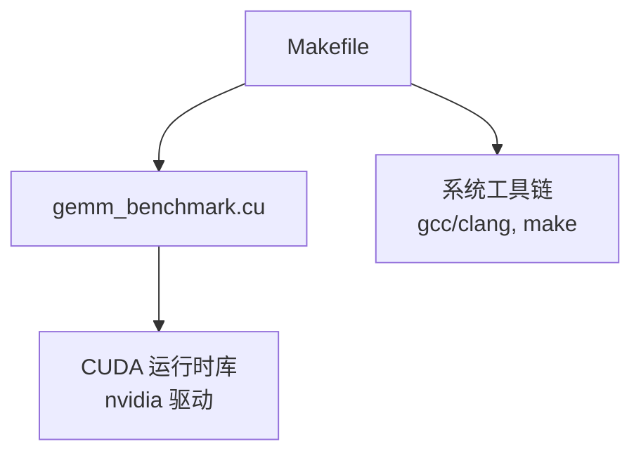
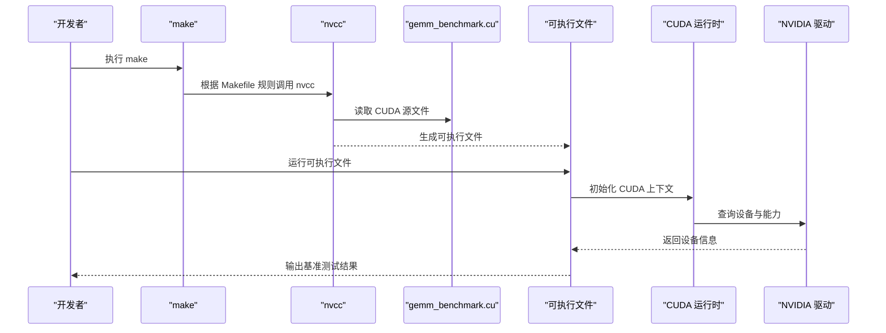
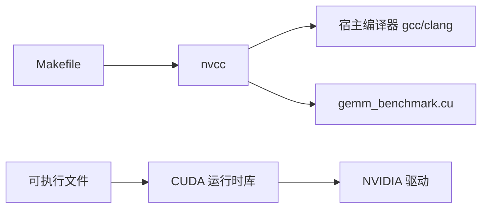

# 安装与环境配置

<cite>
**本文引用的文件**   
- [Makefile](file://Makefile)
- [gemm_benchmark.cu](file://gemm_benchmark.cu)
</cite>

## 目录
1. [简介](#简介)
2. [项目结构](#项目结构)
3. [核心组件](#核心组件)
4. [架构总览](#架构总览)
5. [详细组件分析](#详细组件分析)
6. [依赖关系分析](#依赖关系分析)
7. [性能考虑](#性能考虑)
8. [故障排除指南](#故障排除指南)
9. [结论](#结论)
10. [附录](#附录)

## 简介
本文件面向需要在本地环境编译与运行 CUDA GEMM 基准程序的开发者，提供完整的安装与环境配置说明。内容涵盖：
- CUDA Toolkit 的安装要求与版本兼容性
- 编译环境的设置步骤（nvcc 编译器配置、依赖检查）
- Makefile 的使用方法与自定义选项
- 常见安装问题的故障排除（驱动不匹配、编译器路径问题等）
- 验证安装的测试步骤
- Linux 与 Windows 的具体安装指导

本项目由一个 CUDA 源文件和一个 Makefile 构成，用于在支持 CUDA 的 GPU 上执行矩阵乘法基准测试并输出结果。

## 项目结构
仓库包含两个关键文件：
- Makefile：定义构建目标、CUDA 编译器参数、可选优化开关以及默认目标。
- gemm_benchmark.cu：CUDA 程序入口，包含内核与主机端逻辑，用于执行 GEMM 基准测试。

图表来源
- [Makefile:1-200](file://Makefile#L1-L200)
- [gemm_benchmark.cu:1-200](file://gemm_benchmark.cu#L1-L200)

章节来源
- [Makefile:1-200](file://Makefile#L1-L200)
- [gemm_benchmark.cu:1-200](file://gemm_benchmark.cu#L1-L200)

## 核心组件
- 构建系统（Makefile）
  - 负责调用 nvcc 编译 CUDA 源文件，生成可执行文件。
  - 提供常用构建目标（如默认构建、清理）。
  - 暴露可配置的变量（例如架构、优化级别、调试开关），便于在不同平台与 GPU 上定制编译。
- 源代码（gemm_benchmark.cu）
  - 实现 GEMM 计算的内核与主机侧调度。
  - 通过标准输入/输出或日志打印基准测试结果。

章节来源
- [Makefile:1-200](file://Makefile#L1-L200)
- [gemm_benchmark.cu:1-200](file://gemm_benchmark.cu#L1-L200)

## 架构总览
下图展示了从源码到可执行文件的构建流程，以及运行时对 CUDA 驱动与运行时库的依赖关系。

图表来源
- [Makefile:1-200](file://Makefile#L1-L200)
- [gemm_benchmark.cu:1-200](file://gemm_benchmark.cu#L1-L200)

## 详细组件分析

### Makefile 分析与使用
- 主要职责
  - 定义 nvcc 命令及参数（架构、优化、调试、头文件路径等）。
  - 提供默认构建目标与清理目标。
  - 暴露可覆盖的变量，便于跨平台与不同 GPU 架构适配。
- 典型用法
  - 直接执行 make 进行默认构建。
  - 指定架构或优化级别，例如通过环境变量或命令行覆盖变量。
  - 清理构建产物。
- 自定义建议
  - 若需针对特定 GPU 架构优化，调整架构相关变量。
  - 开启调试时添加相应标志；发布构建时启用优化。
  - 如需链接额外库，可在链接阶段追加库路径与库名。

章节来源
- [Makefile:1-200](file://Makefile#L1-L200)

### 源代码 gemm_benchmark.cu 概览
- 功能概述
  - 实现 GEMM 基准测试，包括内存分配、内核调用与结果校验/统计。
  - 通过标准输出打印测试结果，便于自动化验证。
- 运行前提
  - 需要可用的 NVIDIA GPU 与已正确安装的 CUDA 运行时。
  - 确保驱动版本满足 CUDA 运行时要求。

章节来源
- [gemm_benchmark.cu:1-200](file://gemm_benchmark.cu#L1-L200)

## 依赖关系分析
- 构建期依赖
  - nvcc：CUDA 编译器，必须存在于 PATH 或可通过环境变量指定。
  - make：构建系统。
  - 宿主编译器（gcc/clang）：由 nvcc 在必要时调用。
- 运行期依赖
  - CUDA 运行时库：随 CUDA Toolkit 安装。
  - NVIDIA 驱动：版本需满足 CUDA 运行时最低要求。

图表来源
- [Makefile:1-200](file://Makefile#L1-L200)
- [gemm_benchmark.cu:1-200](file://gemm_benchmark.cu#L1-L200)

章节来源
- [Makefile:1-200](file://Makefile#L1-L200)
- [gemm_benchmark.cu:1-200](file://gemm_benchmark.cu#L1-L200)

## 性能考虑
- 选择合适的 GPU 架构以启用最佳优化。
- 在发布构建中启用优化标志，避免调试开销。
- 合理设置线程块与网格尺寸（由源码实现决定），以获得更高吞吐。
- 避免不必要的 I/O 与重复初始化，减少基准噪声。

[本节为通用性能建议，无需代码引用]

## 故障排除指南
常见问题与解决思路：
- 找不到 nvcc
  - 确认 CUDA Toolkit 已安装且 PATH 中包含 nvcc 所在目录。
  - 在 Windows 上使用“适用于 Visual Studio 的 x64 本机工具命令提示符”或等效环境。
- 驱动版本不匹配
  - 检查 nvidia-smi 显示的驱动版本与 CUDA 运行时版本是否兼容。
  - 升级驱动或降级 CUDA 版本以满足最低要求。
- 宿主编译器缺失或不兼容
  - 安装匹配的 gcc/clang 或 MSVC 工具集，并确保版本受 nvcc 支持。
- 权限或路径问题
  - 确保对构建目录有读写权限。
  - 检查头文件与库路径是否正确。
- 运行时错误（无设备、初始化失败）
  - 确认 GPU 可用且未被占用。
  - 重启会话或重新加载驱动模块（Linux）。

章节来源
- [Makefile:1-200](file://Makefile#L1-L200)
- [gemm_benchmark.cu:1-200](file://gemm_benchmark.cu#L1-L200)

## 结论
通过正确安装 CUDA Toolkit、配置编译器环境与遵循 Makefile 的构建约定，即可在本机成功编译并运行 GEMM 基准程序。遇到问题时，优先检查驱动与运行时版本匹配、nvcc 可用性以及宿主编译器环境。

[本节为总结性内容，无需代码引用]

## 附录

### 安装与配置步骤（Linux）
- 安装 CUDA Toolkit
  - 下载对应版本的 CUDA Toolkit 安装包。
  - 按官方指引安装，并将 bin 与 lib 目录加入 PATH 与 LD_LIBRARY_PATH。
- 安装驱动
  - 安装与 CUDA 运行时兼容的 NVIDIA 驱动。
- 验证环境
  - 运行 nvcc --version 确认编译器可用。
  - 运行 nvidia-smi 确认驱动与 GPU 状态正常。
- 构建与运行
  - 在项目根目录执行 make 进行构建。
  - 运行生成的可执行文件，观察基准测试结果。

章节来源
- [Makefile:1-200](file://Makefile#L1-L200)
- [gemm_benchmark.cu:1-200](file://gemm_benchmark.cu#L1-L200)

### 安装与配置步骤（Windows）
- 安装 CUDA Toolkit
  - 下载并安装 CUDA Toolkit，选择与 Visual Studio 集成选项。
- 安装开发工具
  - 安装与 nvcc 兼容的 MSVC 工具集。
- 验证环境
  - 打开“适用于 Visual Studio 的 x64 本机工具命令提示符”。
  - 运行 nvcc --version 与 nvidia-smi 确认环境就绪。
- 构建与运行
  - 在命令提示符中进入项目目录，执行 make（若安装了 GNU make）或使用提供的构建脚本。
  - 运行生成的可执行文件。

章节来源
- [Makefile:1-200](file://Makefile#L1-L200)
- [gemm_benchmark.cu:1-200](file://gemm_benchmark.cu#L1-L200)

### 验证安装的测试步骤
- 基础检查
  - nvcc --version：确认编译器版本。
  - nvidia-smi：确认驱动与 GPU 状态。
- 构建检查
  - 执行 make，确认无报错并生成可执行文件。
- 运行检查
  - 运行可执行文件，观察输出是否正常，无运行时错误。

章节来源
- [Makefile:1-200](file://Makefile#L1-L200)
- [gemm_benchmark.cu:1-200](file://gemm_benchmark.cu#L1-L200)

### Makefile 使用方法与自定义选项
- 基本命令
  - make：默认构建目标。
  - make clean：清理构建产物。
- 自定义选项
  - 通过环境变量或命令行覆盖 Makefile 中的变量（如架构、优化级别、调试开关）。
  - 如需链接第三方库，可在链接阶段追加库路径与库名。
- 注意事项
  - 确保 nvcc 与宿主编译器版本受支持。
  - 针对不同 GPU 架构调整相关变量以获得最佳性能。

章节来源
- [Makefile:1-200](file://Makefile#L1-L200)