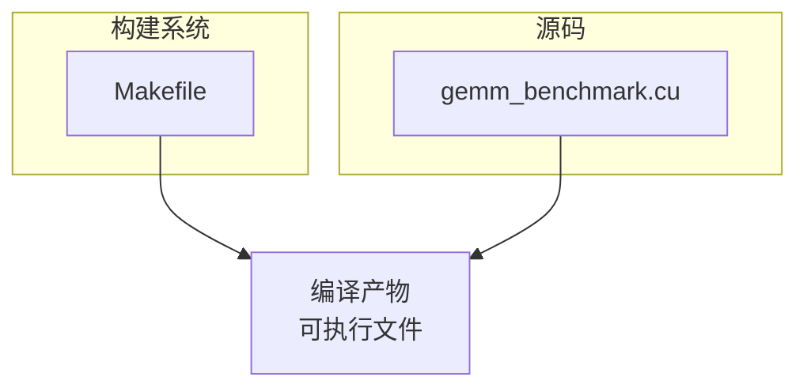
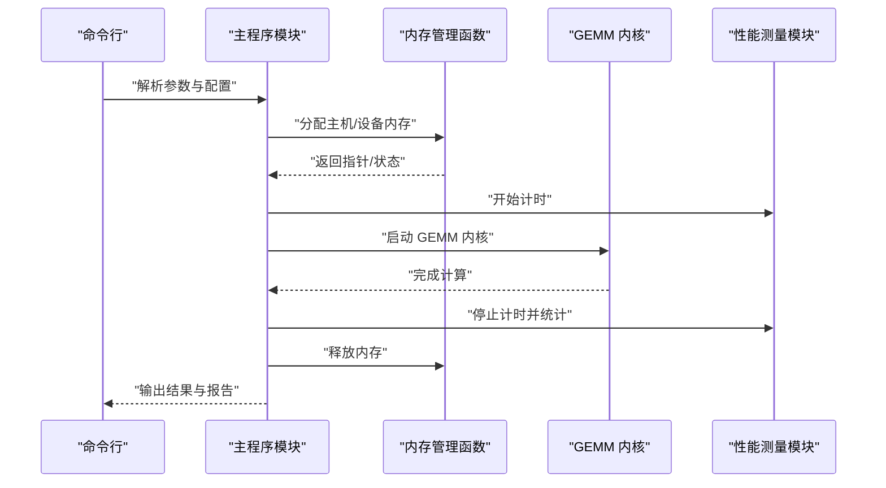
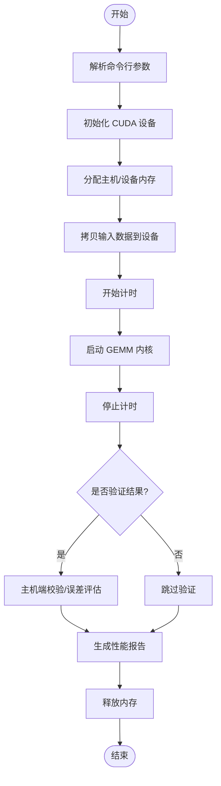
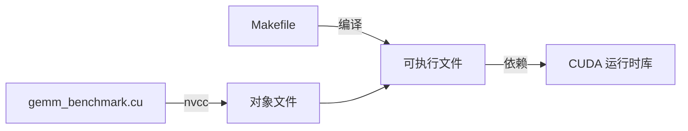

# 代码结构分析

<cite>
**本文档引用的文件**   
- [Makefile](file://Makefile)
- [gemm_benchmark.cu](file://gemm_benchmark.cu)
</cite>

## 目录
1. [简介](#简介)
2. [项目结构](#项目结构)
3. [核心组件](#核心组件)
4. [架构总览](#架构总览)
5. [详细组件分析](#详细组件分析)
6. [依赖关系分析](#依赖关系分析)
7. [性能考量](#性能考量)
8. [故障排查指南](#故障排查指南)
9. [结论](#结论)
10. [附录](#附录)

## 简介
本项目是一个基于 CUDA 的 GEMM（通用矩阵乘法）基准测试，包含一个主程序与构建脚本。目标是通过可配置的矩阵规模、数据类型与内核策略，测量不同实现的性能，并输出关键指标以便对比和优化。文档面向新加入的开发者，帮助快速理解整体架构、模块职责、数据流以及构建流程。

## 项目结构
仓库仅包含两个文件：
- Makefile：定义编译选项、目标、依赖与清理规则，用于生成可执行基准程序。
- gemm_benchmark.cu：CUDA 源文件，包含主程序入口、GEMM 内核实现、内存管理函数与性能测量逻辑。

图表来源
- [Makefile](file://Makefile)
- [gemm_benchmark.cu](file://gemm_benchmark.cu)

章节来源
- [Makefile](file://Makefile)
- [gemm_benchmark.cu](file://gemm_benchmark.cu)

## 核心组件
- 主程序模块
  - 负责解析命令行参数、配置运行参数、分配/释放内存、调用内核、计时与结果验证、打印报告。
- GEMM 内核实现
  - 提供至少一种 GPU 上的矩阵乘法内核实现，可能包含不同的线程块/网格划分策略或优化技巧。
- 内存管理函数
  - 封装主机端与设备端的分配、拷贝与释放操作，确保错误检查与一致性。
- 性能测量模块
  - 使用 CUDA 事件或 CPU 时间进行计时，统计吞吐、时延与重复次数，支持多次采样取稳定值。

章节来源
- [gemm_benchmark.cu](file://gemm_benchmark.cu)

## 架构总览
下图展示了从命令行到内核执行与计时的典型调用链，体现“主程序 → 内存管理 → 内核 → 计时/验证”的数据与控制流。

图表来源
- [gemm_benchmark.cu](file://gemm_benchmark.cu)

## 详细组件分析

### 主程序模块
- 职责
  - 解析命令行参数（如矩阵维度 M/N/K、数据类型、迭代次数、是否验证等）。
  - 初始化 CUDA 上下文与设备信息。
  - 组织输入数据、调用内存管理函数进行分配与拷贝。
  - 调用性能测量模块进行计时，调用 GEMM 内核执行计算。
  - 可选的结果验证（主机端参考实现或简单校验），汇总并打印报告。
- 关键点
  - 参数边界检查与默认值处理。
  - 错误路径统一处理（CUDA 错误码检查、资源回滚）。
  - 多轮采样与异常值剔除（例如丢弃前几轮预热）。

章节来源
- [gemm_benchmark.cu](file://gemm_benchmark.cu)

### GEMM 内核实现
- 职责
  - 在 GPU 上执行矩阵乘 A×B=C，按行/列分块或采用共享内存优化。
  - 根据传入的维度与步幅参数正确索引元素，避免越界。
- 设计要点
  - 线程映射策略（每个线程计算 C 的一个或多个元素）。
  - 可能的分块大小选择与寄存器/共享内存权衡。
  - 对齐与填充策略（如需提升访存合并效率）。
- 扩展点
  - 新增不同内核变体（如 Tiled、Vectorized、Tensor Core 路径）并通过开关切换。

章节来源
- [gemm_benchmark.cu](file://gemm_benchmark.cu)

### 内存管理函数
- 职责
  - 主机端与设备端内存分配、释放。
  - 主机与设备间数据拷贝（A、B 输入；C 输出）。
  - 统一的错误检查与日志输出。
- 注意事项
  - 失败时保证已分配资源的释放，避免泄漏。
  - 对大型矩阵考虑分批或分页内存策略（若需要）。

章节来源
- [gemm_benchmark.cu](file://gemm_benchmark.cu)

### 性能测量模块
- 职责
  - 使用 CUDA 事件或 CPU 计时器记录内核执行时间。
  - 支持多次迭代，计算平均/中位数/方差等统计量。
  - 将时间转换为吞吐量（GFLOPS）并输出。
- 最佳实践
  - 预热若干次以消除冷启动影响。
  - 同步以确保准确计时（必要时在计时前后插入同步点）。

章节来源
- [gemm_benchmark.cu](file://gemm_benchmark.cu)

### 数据流图
下图展示一次基准测试的数据流向：从命令行参数到最终报告。

图表来源
- [gemm_benchmark.cu](file://gemm_benchmark.cu)

## 依赖关系分析
- 构建依赖
  - Makefile 通过 nvcc 编译 gemm_benchmark.cu，链接 CUDA 运行时库，生成可执行文件。
  - 可通过变量控制优化级别、目标架构、调试符号等。
- 运行时依赖
  - CUDA 驱动与运行时版本需满足要求。
  - 目标 GPU 架构需与编译指定架构匹配。

图表来源
- [Makefile](file://Makefile)
- [gemm_benchmark.cu](file://gemm_benchmark.cu)

章节来源
- [Makefile](file://Makefile)
- [gemm_benchmark.cu](file://gemm_benchmark.cu)

## 性能考量
- 内核层面
  - 合理的线程块尺寸与网格布局，充分利用 SM 资源。
  - 共享内存缓存与访存合并，减少全局内存带宽瓶颈。
  - 针对大矩阵的分块策略与流水线化。
- 计时与统计
  - 预热与多次采样，排除抖动与冷启动影响。
  - 区分内核执行时间与数据传输时间，分别评估。
- 可扩展性
  - 模块化设计便于替换不同内核实现或添加 Tensor Core 路径。
  - 通过编译宏或运行时参数切换不同优化策略。

[本节为通用指导，不直接分析具体文件]

## 故障排查指南
- 常见问题
  - 编译失败：检查 nvcc 版本、CUDA 路径、目标架构标志是否正确。
  - 运行时崩溃：确认设备内存充足、参数合法（M/N/K 非负且合理）、CUDA API 返回值检查。
  - 性能异常：确认预热次数足够、未误将同步开销计入、数据传输未混入计时。
- 定位方法
  - 启用详细日志与错误码检查。
  - 逐步缩小矩阵规模定位问题。
  - 使用 CUDA 工具链（如 nsight）辅助分析。

章节来源
- [gemm_benchmark.cu](file://gemm_benchmark.cu)

## 结论
本项目结构简洁清晰，围绕 GEMM 基准测试的核心目标，将主程序、内核实现、内存管理与性能测量解耦，便于扩展与维护。通过 Makefile 统一管理构建流程，开发者可以快速在不同实现之间对比性能，并持续优化。

[本节为总结性内容，不直接分析具体文件]

## 附录
- 快速上手建议
  - 阅读 Makefile 中的编译选项，了解如何调整优化级别与目标架构。
  - 在 gemm_benchmark.cu 中定位主程序入口，熟悉参数解析与调用顺序。
  - 按需新增内核变体，并在主程序中增加切换逻辑。
- 代码注释规范
  - 函数级注释说明目的、参数、返回值与复杂度。
  - 关键算法步骤与边界条件给出简要说明。
  - 错误处理路径标注原因与恢复策略。

[本节为补充信息，不直接分析具体文件]