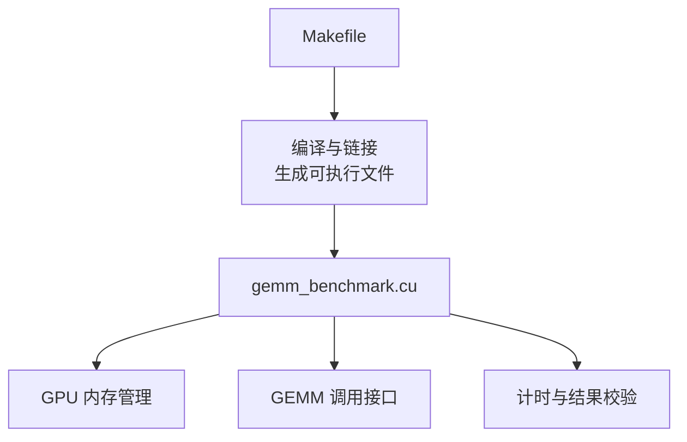
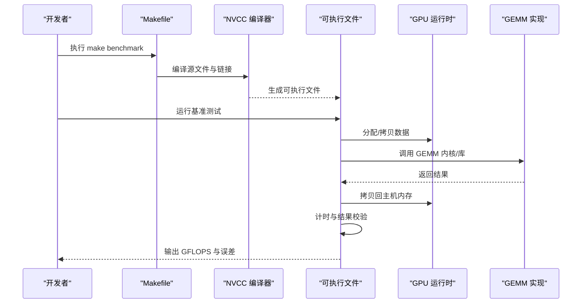
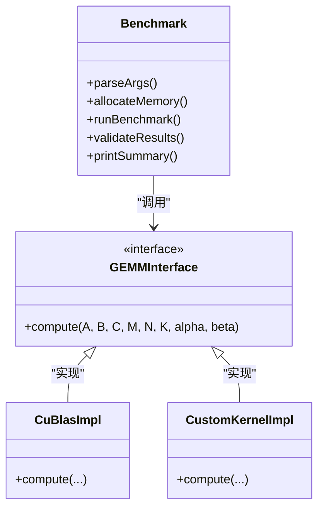
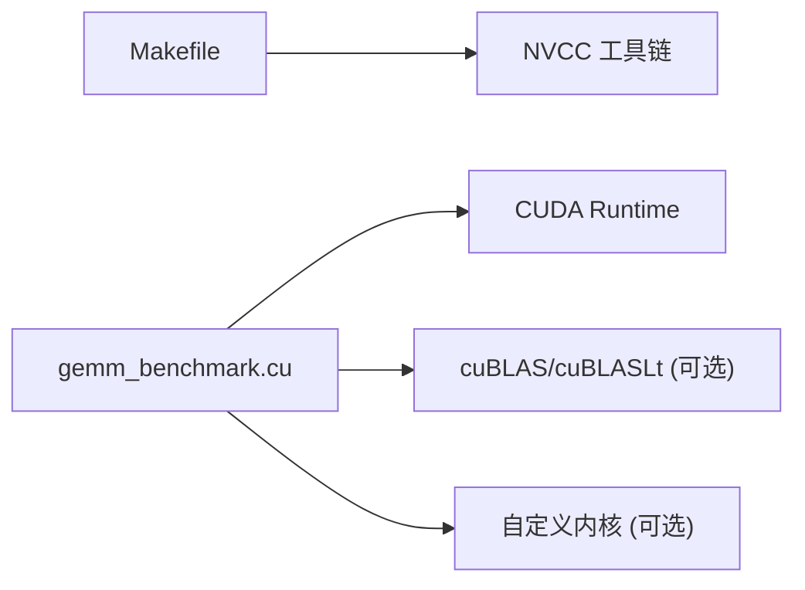

# 开发者指南

<cite>
**本文档引用的文件**   
- [Makefile](file://Makefile)
- [gemm_benchmark.cu](file://gemm_benchmark.cu)
</cite>

## 更新摘要
**所做更改**   
- 新增Git工作流程和版本控制实践章节
- 更新贡献指南以反映现代Git工作流
- 增强分支策略和提交规范
- 添加代码审查流程说明
- 更新CI/CD集成指导

## 目录
1. [简介](#简介)
2. [项目结构](#项目结构)
3. [核心组件](#核心组件)
4. [架构总览](#架构总览)
5. [详细组件分析](#详细组件分析)
6. [依赖关系分析](#依赖关系分析)
7. [性能考虑](#性能考虑)
8. [故障排查指南](#故障排查指南)
9. [Git工作流程与版本控制](#git工作流程与版本控制)
10. [结论](#结论)
11. [附录](#附录)

## 简介
本指南面向希望扩展与优化通用矩阵乘法（GEMM）实现的开发者。当前仓库包含一个 CUDA 基准测试程序与构建脚本，目标是提供清晰的入口、可复现的基准测量流程以及可扩展的集成方式。通过本指南，你将了解：
- 如何理解现有代码结构与模块划分
- 如何添加新的 GEMM 实现与优化策略
- 如何编写自定义内核并集成到现有框架
- 代码风格规范与贡献流程
- 调试技巧与常见问题解决方案
- 单元测试与性能回归测试方法
- 构建系统的定制与扩展
- **新增** Git工作流程和版本控制最佳实践

## 项目结构
仓库采用极简结构，便于快速迭代与聚焦核心目标：
- Makefile：定义编译选项、目标与常用命令
- gemm_benchmark.cu：CUDA 基准测试入口，负责参数解析、内存分配、调用待测 GEMM 实现、计时与结果验证



图表来源
- [Makefile](file://Makefile)
- [gemm_benchmark.cu](file://gemm_benchmark.cu)

章节来源
- [Makefile](file://Makefile)
- [gemm_benchmark.cu](file://gemm_benchmark.cu)

## 核心组件
- 构建系统（Makefile）
  - 定义编译器、NVCC 版本、优化级别、目标平台等
  - 提供 clean、all、benchmark 等常用目标
  - 支持传入额外编译参数以适配不同 GPU 架构或启用特定特性
- 基准测试程序（gemm_benchmark.cu）
  - 命令行参数解析（矩阵维度、数据类型、算法选择、重复次数等）
  - GPU/CPU 内存分配与数据初始化
  - 调用 GEMM 实现（可替换为 cuBLAS、cuBLASLt、自定义内核等）
  - 计时与吞吐计算（GFLOPS）
  - 结果校验（与 CPU 参考实现对比）

章节来源
- [Makefile](file://Makefile)
- [gemm_benchmark.cu](file://gemm_benchmark.cu)

## 架构总览
下图展示了从构建到运行的整体流程，以及基准测试程序的内部职责划分。



图表来源
- [Makefile](file://Makefile)
- [gemm_benchmark.cu](file://gemm_benchmark.cu)

## 详细组件分析

### 构建系统（Makefile）
- 关键职责
  - 设置 NVCC 编译选项（如 -O3、-arch=sm_XX、-use_fast_math 等）
  - 定义头文件搜索路径与依赖关系
  - 提供 clean、all、benchmark 等目标
- 扩展建议
  - 新增架构支持：在 ARCH_FLAGS 中追加 -gencode arch=compute_XX,code=sm_XX
  - 新增算法目标：增加规则将不同实现编译为独立可执行文件或库
  - 并行构建：使用 -j 参数加速编译
- 注意事项
  - 确保目标 GPU 架构与驱动兼容
  - 合理设置缓存目录以避免重复编译

章节来源
- [Makefile](file://Makefile)

### 基准测试程序（gemm_benchmark.cu）
- 关键职责
  - 参数解析：矩阵形状 M/N/K、数据类型（FP32/FP16/BF16）、是否转置、重复次数等
  - 资源管理：GPU/CPU 内存分配、错误检查、同步
  - 算法调度：根据参数选择 cuBLAS/cuBLASLt/自定义内核
  - 性能统计：启动/停止计时、计算 GFLOPS、打印摘要
  - 正确性校验：与 CPU 参考实现比较误差（相对/绝对误差阈值）
- 扩展建议
  - 新增算法：在调度逻辑中添加分支，注册新实现
  - 新增数据类型：扩展类型枚举与转换逻辑
  - 新增度量指标：如显存带宽、延迟分布、峰值利用率
- 注意事项
  - 避免在计时区间内包含无关操作
  - 多次重复以稳定测量结果
  - 处理大矩阵时的溢出与精度问题

章节来源
- [gemm_benchmark.cu](file://gemm_benchmark.cu)

### 自定义内核与集成流程
- 步骤概览
  - 编写 CUDA 内核函数（注意线程块/网格配置、共享内存使用、向量化加载）
  - 封装为统一 API（输入指针、维度、步长、数据类型、流等）
  - 在基准程序中注册该实现，并通过参数选择
  - 在 Makefile 中将新源文件加入编译列表
- 最佳实践
  - 使用模板或宏减少重复代码
  - 针对常见尺寸进行特化（如 K 对齐、分块大小）
  - 提供 fallback 实现保证鲁棒性

章节来源
- [gemm_benchmark.cu](file://gemm_benchmark.cu)
- [Makefile](file://Makefile)

### 类图（概念映射）
下图展示基准测试程序与 GEMM 实现之间的抽象关系，便于理解扩展点。



图表来源
- [gemm_benchmark.cu](file://gemm_benchmark.cu)

## 依赖关系分析
- 直接依赖
  - Makefile 依赖 NVCC 工具链与目标 GPU 架构
  - gemm_benchmark.cu 依赖 CUDA Runtime 与可选的 cuBLAS/cuBLASLt
- 间接依赖
  - 操作系统与 GPU 驱动版本影响可用特性与性能
- 潜在循环依赖
  - 当前结构无循环依赖；新增实现时应保持单向依赖（基准程序依赖实现）



图表来源
- [Makefile](file://Makefile)
- [gemm_benchmark.cu](file://gemm_benchmark.cu)

章节来源
- [Makefile](file://Makefile)
- [gemm_benchmark.cu](file://gemm_benchmark.cu)

## 性能考虑
- 测量稳定性
  - 预热 GPU 与缓存
  - 多次重复取中位数或均值
  - 固定随机种子以保证可复现
- 内存访问
  - 合并访问与对齐
  - 合理使用共享内存与寄存器
- 计算优化
  - 分块与流水线
  - 向量化指令与张量核心（如适用）
- 工具辅助
  - 使用 nvprof/nsys 分析热点与瓶颈
  - 监控显存带宽与 SM 利用率

[本节为通用指导，不直接分析具体文件]

## 故障排查指南
- 编译失败
  - 检查 NVCC 版本与 -arch 设置是否匹配驱动
  - 确认头文件路径与库路径正确
- 运行时崩溃
  - 检查内存分配与越界访问
  - 使用 cuda-memcheck 定位非法访问
- 性能异常
  - 确认未将无关操作放入计时区间
  - 检查是否触发了 fallback 实现
- 结果不正确
  - 调整误差阈值
  - 核对数据类型与转置标志

章节来源
- [Makefile](file://Makefile)
- [gemm_benchmark.cu](file://gemm_benchmark.cu)

## Git工作流程与版本控制

### 分支策略
采用功能分支模型进行版本控制：
- **主分支保护**
  - `main` 分支：生产环境代码，保持稳定
  - `develop` 分支：开发集成分支，包含最新功能
- **功能分支命名规范**
  - `feature/xxx`：新功能开发
  - `fix/xxx`：bug修复
  - `enhance/xxx`：性能优化
  - `refactor/xxx`：代码重构
- **发布分支**
  - `release/x.y.z`：版本发布准备
  - `hotfix/xxx`：紧急修复

### 提交信息规范
遵循约定式提交格式：
```
<type>(<scope>): <subject>

<body>

<footer>
```

**提交类型**：
- `feat`: 新功能
- `fix`: 修复bug
- `docs`: 文档更新
- `style`: 代码格式（不影响功能）
- `refactor`: 重构
- `test`: 测试相关
- `chore`: 构建过程或辅助工具变动

**示例**：
```
feat(gemm): 添加FP16数据类型支持

- 扩展数据类型枚举
- 更新内存分配逻辑
- 添加FP16基准测试

Closes #123
```

### 代码审查流程
1. **本地检查**
   - 运行所有单元测试
   - 执行代码格式化
   - 检查代码质量工具
2. **Pull Request**
   - 创建描述性的PR标题和说明
   - 关联相关Issue
   - 等待至少一名维护者审查
3. **CI/CD检查**
   - 自动化测试通过
   - 性能基准测试通过
   - 代码覆盖率达标

### 版本标签管理
- **语义化版本控制**
  - `v1.2.3`：主版本.次版本.修订号
  - 主版本：不兼容的API变更
  - 次版本：向后兼容的功能新增
  - 修订号：向后兼容的问题修正
- **预发布版本**
  - `v1.2.3-alpha.1`：Alpha测试版
  - `v1.2.3-beta.1`：Beta测试版
  - `v1.2.3-rc.1`：发布候选版

### 协作最佳实践
- **定期同步**
  - 频繁拉取远程更新
  - 及时推送本地更改
- **冲突解决**
  - 优先沟通再解决冲突
  - 保留详细的解决记录
- **知识共享**
  - 更新相关文档
  - 分享技术经验

**章节来源**
- [Makefile](file://Makefile)
- [gemm_benchmark.cu](file://gemm_benchmark.cu)

## 结论
本指南基于仓库中的构建脚本与基准测试程序，提供了从理解结构到扩展实现的完整路径。建议在新增实现时遵循统一的接口约定与代码风格，并通过完善的测试与基准流程保障质量与性能。**新增的Git工作流程和版本控制实践**确保了团队协作的高效性和代码的可追溯性。

[本节为总结性内容，不直接分析具体文件]

## 附录

### 代码风格规范
- 命名
  - 变量与函数使用小写+下划线或驼峰，保持一致
  - 常量与宏使用大写+下划线
- 注释
  - 关键函数与复杂逻辑需有清晰注释
  - 参数含义、返回值、复杂度说明
- 错误处理
  - 统一错误码与日志格式
  - 资源释放与清理
- 格式化
  - 使用 clang-format/nvcc 默认风格
  - 提交前自动格式化

[本节为通用指导，不直接分析具体文件]

### 贡献指南
- **分支策略**
  - 功能分支命名 feature/xxx
  - 修复分支命名 fix/xxx
- **提交信息**
  - 简洁描述变更目的与影响范围
  - 关联 Issue/Pull Request
- **审查流程**
  - 至少一名维护者审查
  - 通过自动化测试与基准后合并
- **代码质量**
  - 遵循统一的编码规范
  - 包含必要的单元测试
  - 更新相关文档

[本节为通用指导，不直接分析具体文件]

### 单元测试与性能回归测试
- **单元测试**
  - 覆盖边界条件（零维、方阵、非方阵、转置）
  - 数据类型与精度验证
- **性能回归**
  - 固定数据集与参数
  - 记录 GFLOPS 与误差阈值
  - CI 中自动比对历史基线
- **测试工具**
  - CUDA单元测试框架
  - 性能基准测试套件
  - 内存泄漏检测

[本节为通用指导，不直接分析具体文件]

### 构建系统定制与扩展
- **新增目标**
  - 在 Makefile 中添加规则与依赖
  - 分离不同实现的编译单元
- **交叉编译**
  - 指定目标架构与工具链
- **打包与分发**
  - 生成静态/动态库
  - 提供安装脚本

[本节为通用指导，不直接分析具体文件]

### Git工作流配置
- **本地Git配置**
  ```bash
  git config --global user.name "Your Name"
  git config --global user.email "your.email@example.com"
  git config --global core.editor "vim"
  ```
- **预提交钩子**
  - 自动代码格式化
  - 运行基础测试
  - 检查提交信息格式
- **持续集成**
  - GitHub Actions/GitLab CI配置
  - 自动化测试流水线
  - 性能基准监控

[本节为通用指导，不直接分析具体文件]