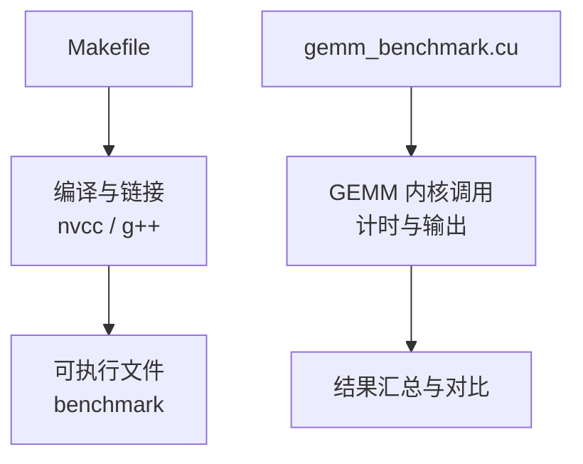
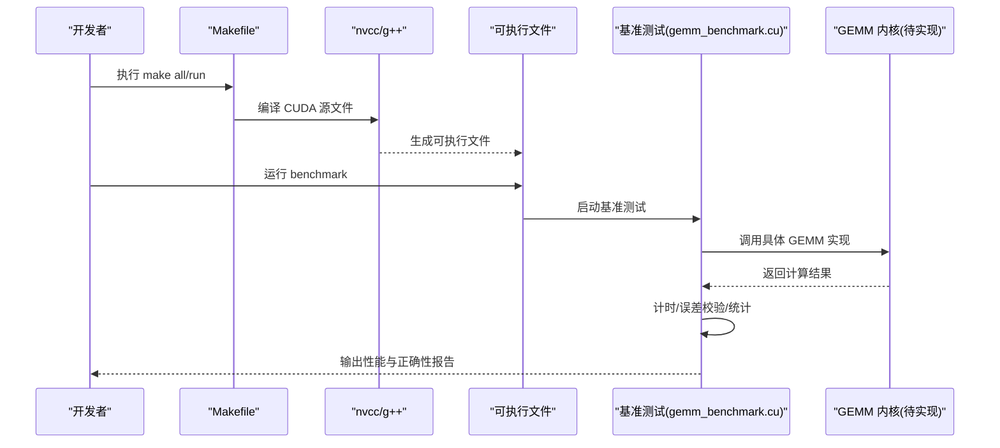
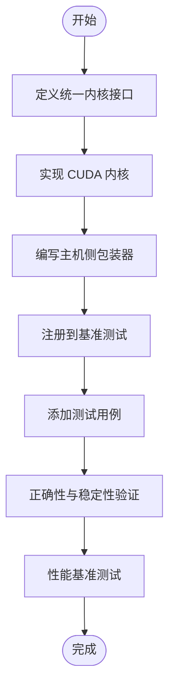
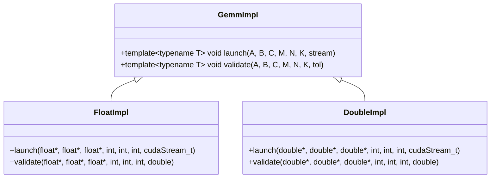
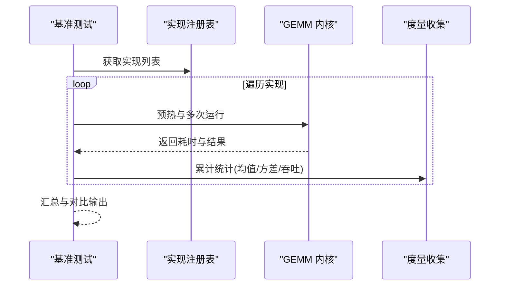
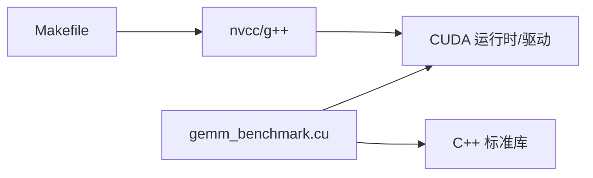

# 扩展开发指南

<cite>
**本文引用的文件**   
- [Makefile](file://Makefile)
- [gemm_benchmark.cu](file://gemm_benchmark.cu)
</cite>

## 目录
1. [简介](#简介)
2. [项目结构](#项目结构)
3. [核心组件](#核心组件)
4. [架构总览](#架构总览)
5. [详细组件分析](#详细组件分析)
6. [依赖分析](#依赖分析)
7. [性能考虑](#性能考虑)
8. [故障排查指南](#故障排查指南)
9. [结论](#结论)
10. [附录](#附录)

## 简介
本指南面向希望在现有 GEMM（通用矩阵乘法）框架中扩展新算法实现的开发者。内容涵盖：
- 如何编写与集成新的 CUDA 内核函数
- 如何在现有基准测试中注册并对比新实现
- 模板化/泛型化的开发模式，支持多种数据类型
- 性能基准测试的集成方法与结果对比机制
- 调试技巧与最佳实践

本项目当前包含一个 CUDA 基准测试程序与构建脚本，适合作为扩展新 GEMM 实现的起点。

## 项目结构
- Makefile：负责编译 CUDA 代码、链接依赖、生成可执行文件与目标规则
- gemm_benchmark.cu：CUDA 基准测试入口，组织不同 GEMM 实现、配置问题规模、计时与结果输出

图表来源 
- [Makefile](file://Makefile)
- [gemm_benchmark.cu](file://gemm_benchmark.cu)

章节来源
- [Makefile](file://Makefile)
- [gemm_benchmark.cu](file://gemm_benchmark.cu)

## 核心组件
- 构建系统（Makefile）
  - 定义编译器、优化选项、目标平台特性
  - 提供 clean、all、run 等常用目标
  - 管理 CUDA 源文件的编译与链接
- 基准测试程序（gemm_benchmark.cu）
  - 初始化设备与内存
  - 选择并调用不同的 GEMM 实现
  - 进行多轮计时、误差校验与结果打印
  - 可扩展以注册新实现

章节来源
- [Makefile](file://Makefile)
- [gemm_benchmark.cu](file://gemm_benchmark.cu)

## 架构总览
下图展示了从构建到运行再到结果输出的整体流程，以及新增 GEMM 实现应接入的关键位置。

图表来源 
- [Makefile](file://Makefile)
- [gemm_benchmark.cu](file://gemm_benchmark.cu)

## 详细组件分析

### 构建系统（Makefile）分析与扩展要点
- 关键职责
  - 设置 nvcc 与 g++ 参数（如 -O3、-arch、-std=c++17 等）
  - 定义源文件集合与目标产物
  - 提供 clean、all、run 等便捷目标
- 扩展建议
  - 为新 GEMM 实现添加独立源文件，并在变量集中管理
  - 通过条件编译或运行时开关切换不同实现
  - 增加 profiling 与调试目标（如 -g -lineinfo、-ptxas-options=-v）

章节来源
- [Makefile](file://Makefile)

### 基准测试程序（gemm_benchmark.cu）分析与扩展要点
- 关键职责
  - 设备初始化与错误检查
  - 分配主机/设备内存，准备输入数据
  - 选择并调用不同 GEMM 实现
  - 计时、误差校验、结果打印与汇总
- 扩展建议
  - 将每种 GEMM 实现封装为统一接口（例如统一的函数签名与返回值约定）
  - 在基准测试中维护“实现注册表”，按名称或类型枚举切换
  - 增加多问题规模、多精度、多策略（分块/流水线/向量化）的测试矩阵
  - 引入更严格的误差容忍与数值稳定性检查

章节来源
- [gemm_benchmark.cu](file://gemm_benchmark.cu)

### 新增 GEMM 算法实现的标准流程
- 步骤概览
  1) 设计内核接口：统一输入输出指针、维度、步长、数据类型
  2) 实现 CUDA 内核：线程块划分、共享内存使用、访存合并
  3) 编写主机侧包装器：参数校验、内存分配/拷贝、内核启动配置
  4) 注册到基准测试：加入实现列表，支持按名称或 ID 调用
  5) 添加测试用例：覆盖典型尺寸、边界情况、数值精度
  6) 性能与正确性验证：计时、吞吐、误差、稳定性

[本图为概念流程图，不直接映射具体源码文件]

### 模板化/泛型化开发模式（C++ 模板 + CUDA）
- 目标
  - 用单一模板实现覆盖多种数据类型（如 float、double、half/bfloat16）
  - 通过模板特化或 SFINAE/Concepts 控制不同精度的行为差异
- 建议
  - 使用模板参数 T 表示数据类型，统一内核与包装器签名
  - 对特殊类型（如半精度）提供特化路径，避免隐式转换开销
  - 借助 constexpr 与 if constexpr 在编译期选择最优实现

[本图为概念类图，用于说明模板化实现的组织方式]

### 性能基准测试集成与结果对比机制
- 集成方法
  - 在基准测试中维护实现列表，遍历所有已注册实现
  - 对每个实现执行多次迭代，取稳定后的平均耗时与方差
  - 记录吞吐（GFLOPS）、带宽利用率、峰值占用等指标
- 结果对比
  - 输出表格形式：实现名、数据类型、问题规模、耗时、吞吐、误差
  - 可选：生成 CSV/JSON 便于后续可视化与分析
  - 支持回归检测：与基线版本比较，超阈告警

[本图为概念序列图，展示基准测试与实现的交互流程]

## 依赖分析
- 内部依赖
  - Makefile 依赖 nvcc/g++ 工具链与 CUDA 库
  - gemm_benchmark.cu 依赖 CUDA Runtime API、标准库与可能的数学库
- 外部依赖
  - CUDA 驱动与运行时版本需与 -arch 匹配
  - 若使用第三方库（如 cuBLAS），需在 Makefile 中声明链接参数

图表来源 
- [Makefile](file://Makefile)
- [gemm_benchmark.cu](file://gemm_benchmark.cu)

章节来源
- [Makefile](file://Makefile)
- [gemm_benchmark.cu](file://gemm_benchmark.cu)

## 性能考虑
- 访存优化
  - 确保全局内存访问合并，合理分块（tiling）
  - 充分利用共享内存，减少重复加载
- 并行粒度
  - 选择合适的线程块大小与网格布局
  - 利用 warp 级原语与同步减少分支发散
- 数值精度
  - 根据数据类型选择累加精度（如 FP32/FP64）
  - 对半精度路径做归一化与溢出保护
- 计时与测量
  - 使用 cudaEvent 精确计时，排除启动开销
  - 多轮采样，剔除异常值，报告均值与方差
- 资源占用
  - 监控寄存器与共享内存使用，避免阻塞 SM
  - 结合 nsight Compute/Systems 定位瓶颈

[本节为通用指导，不直接分析具体文件]

## 故障排查指南
- 常见错误
  - 未捕获的 CUDA 错误：应在每次 API 调用后检查状态码
  - 内存越界与对齐问题：确保指针与步长符合硬件要求
  - 核函数启动失败：检查 grid/block 维度与资源限制
- 调试技巧
  - 启用 -g -lineinfo 并使用 cuda-gdb/nsight 调试
  - 使用 printf 或日志宏输出关键中间值（谨慎影响性能）
  - 逐步缩小问题规模，定位不稳定场景
- 性能回退
  - 对比不同实现与不同参数组合
  - 使用 profiling 工具识别热点与等待阶段

章节来源
- [gemm_benchmark.cu](file://gemm_benchmark.cu)

## 结论
通过统一的接口设计与模板化实现，可以在现有基准测试框架中快速集成新的 GEMM 算法。配合完善的构建系统与性能评测流程，可实现高效、可复现、可对比的开发闭环。建议在扩展过程中坚持以下原则：接口一致性、数值稳定性、可观测性与可回归性。

[本节为总结性内容，不直接分析具体文件]

## 附录
- 推荐工具链
  - nvcc、g++、cuda-gdb、nsight compute/systems
- 参考规范
  - CUDA 编程最佳实践（访存合并、共享内存、warp 同步）
  - 数值线性代数基础（误差传播、条件数、稳定性）
- 扩展清单
  - 新增实现文件与注册点
  - 更新 Makefile 目标与参数
  - 补充测试用例与基准矩阵
  - 完善文档与示例

[本节为补充信息，不直接分析具体文件]