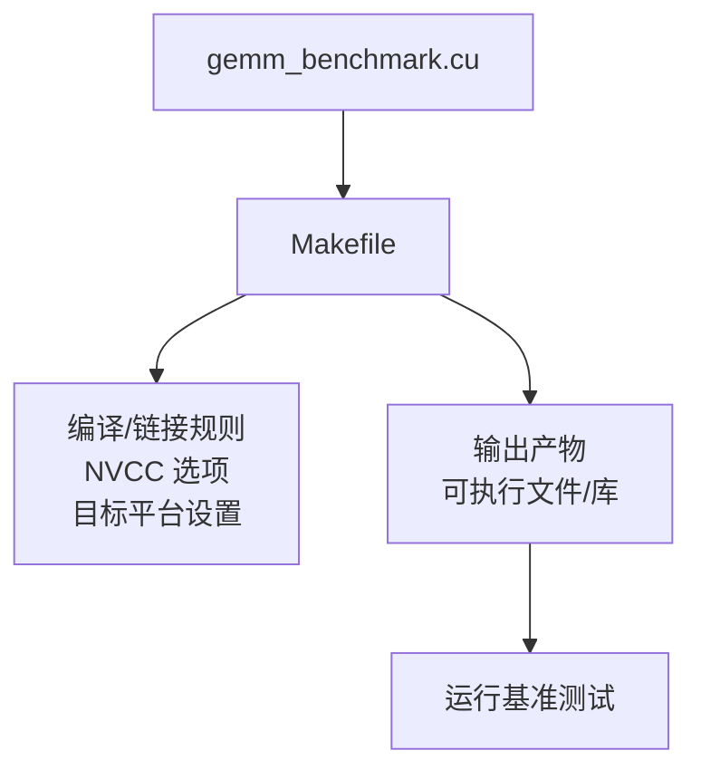
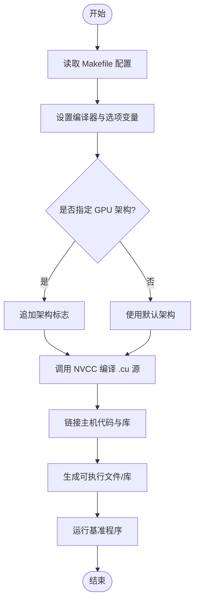
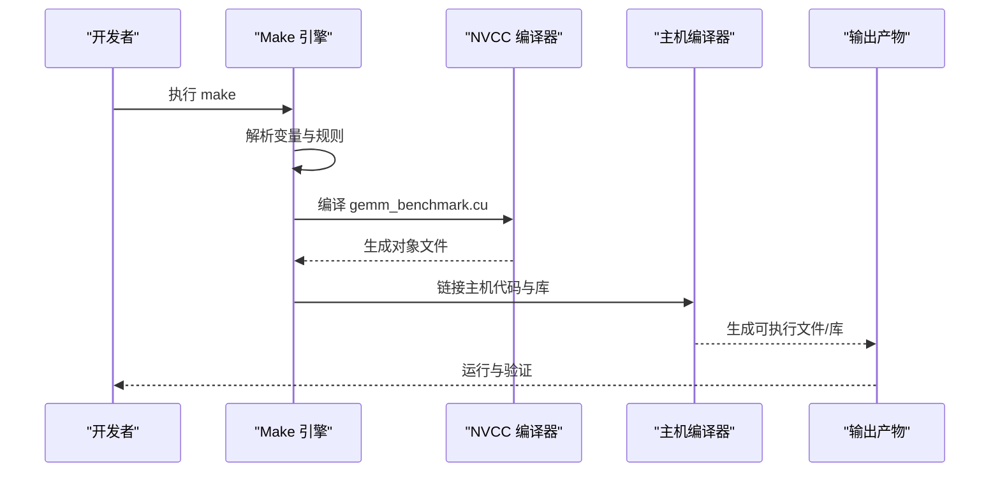

# 构建系统定制

<cite>
**本文引用的文件**   
- [Makefile](file://Makefile)
- [gemm_benchmark.cu](file://gemm_benchmark.cu)
</cite>

## 目录
1. [简介](#简介)
2. [项目结构](#项目结构)
3. [核心组件](#核心组件)
4. [架构总览](#架构总览)
5. [详细组件分析](#详细组件分析)
6. [依赖分析](#依赖分析)
7. [性能考虑](#性能考虑)
8. [故障排查指南](#故障排查指南)
9. [结论](#结论)
10. [附录](#附录)

## 简介
本文件面向使用 Makefile 构建 CUDA GEMM 基准程序的开发者，提供构建系统的深入说明与定制指南。内容涵盖：
- Makefile 配置选项与编译参数详解
- 如何定制 CUDA 编译选项以优化性能或启用调试模式
- 不同目标平台（GPU 架构）的构建配置方法
- 依赖管理与版本兼容性处理策略
- 构建脚本扩展方法与自动化构建流程
- 常见构建问题的解决方案

## 项目结构
当前仓库包含两个关键文件：
- Makefile：定义构建规则、编译器与链接器选项、目标平台等
- gemm_benchmark.cu：CUDA 源代码，作为构建输入生成可执行文件或库

**图表来源** 
- [Makefile](file://Makefile)
- [gemm_benchmark.cu](file://gemm_benchmark.cu)

**章节来源**
- [Makefile](file://Makefile)
- [gemm_benchmark.cu](file://gemm_benchmark.cu)

## 核心组件
- 编译器与工具链
  - NVCC：CUDA 编译器，负责将 .cu 源文件编译为 GPU 代码并生成主机端驱动代码
  - 主机编译器：通常由 NVCC 自动选择（如 gcc/g++），用于链接主机代码
- 构建目标
  - 默认目标：生成可执行文件或库
  - 清理目标：删除中间对象与产物
- 关键变量
  - 编译器路径与命令
  - 编译选项（优化级别、调试信息、警告、语言标准）
  - 链接选项（库路径、库名）
  - 目标 GPU 架构（compute capability）
  - 源文件列表与输出文件名

**章节来源**
- [Makefile](file://Makefile)

## 架构总览
下图展示了从源码到最终产物的构建流程，以及关键环境变量与选项的作用位置。

**图表来源** 
- [Makefile](file://Makefile)
- [gemm_benchmark.cu](file://gemm_benchmark.cu)

**章节来源**
- [Makefile](file://Makefile)

## 详细组件分析

### Makefile 配置项与编译参数
- 编译器与工具链
  - NVCC 命令与路径：确保系统已安装 CUDA Toolkit，且 nvcc 在 PATH 中
  - 主机编译器：通过 NVCC 自动探测，也可显式指定
- 编译选项
  - 优化级别：例如快速构建与高性能构建的不同开关
  - 调试信息：生成调试符号以便使用 cuda-gdb 或 nsight 调试
  - 警告与语言标准：提高代码质量与兼容性
- 链接选项
  - 库路径与库名：如需链接 cuBLAS、cuRAND 等库
- 目标平台
  - compute capability：指定目标 GPU 架构，影响内核生成与性能
- 源文件与输出
  - 源文件列表：包含所有 .cu 与必要的 .c/.cpp
  - 输出文件名：可执行文件或静态/动态库

建议实践：
- 使用变量集中管理选项，便于切换构建模式（Debug/Release）
- 针对不同 GPU 架构维护多组选项，避免跨代不兼容
- 保持最小化依赖，必要时通过环境变量注入额外库路径

**章节来源**
- [Makefile](file://Makefile)

### CUDA 编译选项定制（性能优化与调试）
- 性能优化
  - 开启优化等级（如 Release 模式）
  - 指定目标架构以减少不必要的指令生成
  - 启用内联与向量化相关选项（视 NVCC 支持情况）
- 调试模式
  - 生成调试符号
  - 关闭部分优化以提高调试体验
  - 结合 cuda-gdb/nsight 进行断点与内存检查
- 可选特性
  - 启用特定 CUDA 功能（如 cooperative groups、async copy）需确认架构支持
  - 针对特定库（cuBLAS/cuDNN）的版本匹配

注意事项：
- 不同架构的选项可能不兼容，务必按目标 GPU 精确设置
- 调试模式下性能显著下降，仅用于问题定位

**章节来源**
- [Makefile](file://Makefile)

### 不同目标平台的构建配置
- 识别 GPU 架构
  - 查询设备 compute capability（如 sm_XX）
  - 根据硬件型号选择对应架构标志
- 构建策略
  - 单架构构建：针对单一 GPU 类型，获得最佳性能
  - 多架构构建：生成多个架构的代码段，提升兼容性但增大体积
- 推荐做法
  - 为常用架构维护独立的目标或变量集
  - 在 CI 中并行构建多架构产物，便于分发与测试

**章节来源**
- [Makefile](file://Makefile)

### 依赖管理与版本兼容性
- 外部库
  - cuBLAS、cuRAND、cuSPARSE 等：确保版本与 CUDA Toolkit 匹配
  - 第三方库：通过 pkg-config 或手动指定路径与头文件
- 版本约束
  - 记录 CUDA Toolkit 版本与驱动要求
  - 在构建前进行环境自检（nvcc 版本、可用架构）
- 可移植性
  - 使用条件判断适配不同操作系统与编译器
  - 避免硬编码路径，优先使用环境变量

**章节来源**
- [Makefile](file://Makefile)

### 构建脚本扩展方法与自动化流程
- 扩展点
  - 新增源文件：更新源文件列表
  - 新增目标：添加新的构建目标（如测试、文档、打包）
  - 新增选项：通过变量或命令行传入
- 自动化
  - 集成到 CI/CD：在每次提交时触发构建与测试
  - 产物归档：保存不同架构与模式的构建结果
  - 环境校验：在构建前检查依赖与版本

**章节来源**
- [Makefile](file://Makefile)

### 源码与构建关系

**图表来源** 
- [Makefile](file://Makefile)
- [gemm_benchmark.cu](file://gemm_benchmark.cu)

**章节来源**
- [Makefile](file://Makefile)
- [gemm_benchmark.cu](file://gemm_benchmark.cu)

## 依赖分析
- 直接依赖
  - CUDA Toolkit（nvcc、运行时库）
  - 主机编译器（gcc/g++）
  - 可选库（cuBLAS、cuRAND 等）
- 间接依赖
  - 操作系统提供的标准库
  - 系统包管理器中的开发头文件
- 依赖冲突
  - 不同 CUDA 版本共存导致路径混乱
  - 第三方库版本与 CUDA 不匹配

建议：
- 使用虚拟环境或容器隔离依赖
- 明确记录依赖版本矩阵
- 在构建前进行依赖可用性检测

**章节来源**
- [Makefile](file://Makefile)

## 性能考虑
- 选择合适的优化等级与架构标志
- 减少不必要的调试信息以提升发布构建速度
- 利用并行构建（make -j）缩短编译时间
- 缓存中间产物，避免重复计算

[本节为通用指导，无需具体文件引用]

## 故障排查指南
常见问题与解决思路：
- 找不到 nvcc
  - 检查 CUDA Toolkit 安装与 PATH 设置
  - 确认 nvcc --version 输出正常
- 架构不兼容
  - 核对目标 GPU 的 compute capability
  - 调整 -arch 与 -code 选项
- 链接错误
  - 检查库路径与库名是否正确
  - 确认库版本与 CUDA 版本匹配
- 性能不达预期
  - 确认未启用调试模式
  - 检查是否选择了正确的架构标志
- 构建速度慢
  - 启用并行构建
  - 减少不必要的依赖与头文件扫描

**章节来源**
- [Makefile](file://Makefile)

## 结论
通过合理配置 Makefile 与 CUDA 编译选项，可以为不同 GPU 架构构建出高性能或易调试的 GEMM 基准程序。建议在工程实践中：
- 集中管理构建变量与目标
- 维护清晰的依赖与版本矩阵
- 在 CI 中实现自动化构建与测试
- 遇到问题时依据本指南逐步排查

[本节为总结性内容，无需具体文件引用]

## 附录
- 快速参考
  - 常用变量：编译器、选项、目标、源文件、输出
  - 常用目标：默认构建、清理、多架构构建
  - 常用选项：优化、调试、警告、语言标准
- 扩展建议
  - 增加测试目标与覆盖率统计
  - 集成性能回归测试
  - 生成构建报告与产物清单

[本节为补充信息，无需具体文件引用]