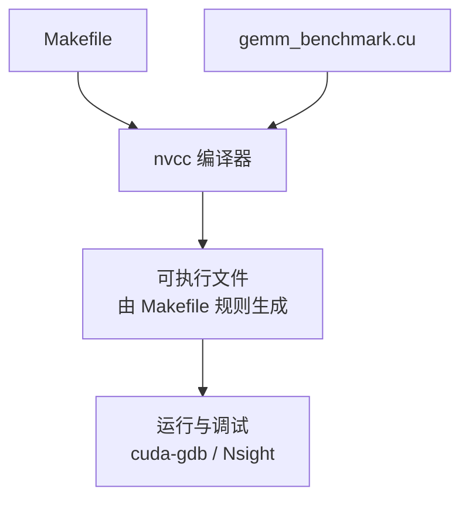
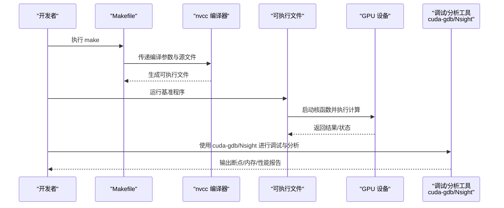
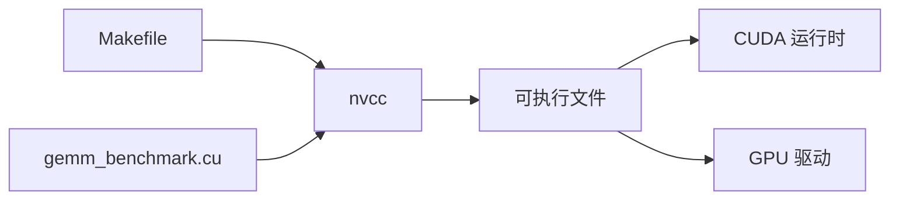
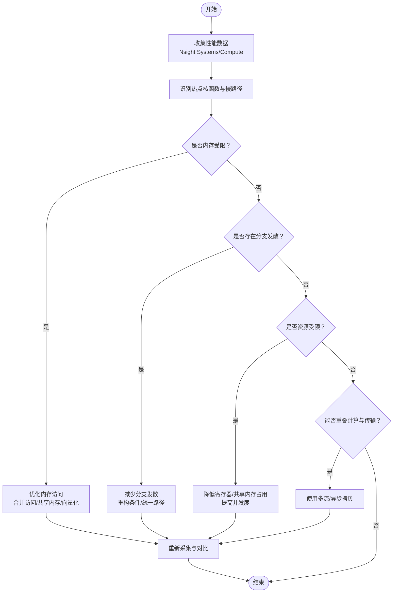

# 调试与故障排除

<cite>
**本文引用的文件**   
- [Makefile](file://Makefile)
- [gemm_benchmark.cu](file://gemm_benchmark.cu)
</cite>

## 目录
1. [简介](#简介)
2. [项目结构](#项目结构)
3. [核心组件](#核心组件)
4. [架构总览](#架构总览)
5. [详细组件分析](#详细组件分析)
6. [依赖关系分析](#依赖关系分析)
7. [性能注意事项](#性能注意事项)
8. [故障排除指南](#故障排除指南)
9. [结论](#结论)
10. [附录](#附录)

## 简介
本指南面向 CUDA 开发者，聚焦于 GEMM（通用矩阵乘法）实现中的常见错误与性能问题，提供系统化的调试与故障排除方法。内容涵盖：
- 内存访问错误、线程同步问题与性能瓶颈的诊断思路
- NVIDIA 调试工具（cuda-gdb、Nsight Systems/Compute）的使用要点
- 编译期错误的常见原因与解决方案
- 性能分析与 profiling 流程
- 实战排查案例与步骤化解决路径

## 项目结构
本项目包含两个关键文件：
- Makefile：构建脚本，负责 nvcc 编译选项、目标生成与清理
- gemm_benchmark.cu：CUDA C++ 源文件，包含核函数与基准测试逻辑

图表来源
- [Makefile:1-200](file://Makefile#L1-L200)
- [gemm_benchmark.cu:1-200](file://gemm_benchmark.cu#L1-L200)

章节来源
- [Makefile:1-200](file://Makefile#L1-L200)
- [gemm_benchmark.cu:1-200](file://gemm_benchmark.cu#L1-L200)

## 核心组件
- 构建系统（Makefile）
  - 定义 nvcc 编译命令、优化与调试开关、头文件与库依赖
  - 提供 clean 等常用目标，便于重复构建与清理中间产物
- 基准程序（gemm_benchmark.cu）
  - 包含 CUDA 核函数（GEMM 计算）、主机端数据准备与计时、结果校验与输出
  - 典型模块划分：输入分配、核函数调用、结果拷贝回主机、验证与统计

章节来源
- [Makefile:1-200](file://Makefile#L1-L200)
- [gemm_benchmark.cu:1-200](file://gemm_benchmark.cu#L1-L200)

## 架构总览
下图展示从构建到运行、再到调试的端到端流程，以及各阶段可能出现的错误类型与定位手段。

图表来源
- [Makefile:1-200](file://Makefile#L1-L200)
- [gemm_benchmark.cu:1-200](file://gemm_benchmark.cu#L1-L200)

## 详细组件分析

### 构建系统（Makefile）
- 作用
  - 封装 nvcc 编译选项（如优化级别、调试符号、架构目标）
  - 管理依赖与目标，确保可重复构建
- 常见问题
  - 未启用调试信息导致无法在 cuda-gdb 中正确定位源码行
  - 未设置正确的 GPU 架构导致运行时崩溃或性能异常
  - 缺少必要的链接选项导致符号缺失
- 建议
  - 为调试构建添加调试符号与未优化开关
  - 明确指定 -arch 以匹配目标 GPU
  - 将常用编译选项集中管理，避免遗漏

章节来源
- [Makefile:1-200](file://Makefile#L1-L200)

### 基准程序（gemm_benchmark.cu）
- 作用
  - 组织 GEMM 核函数与主机端流程
  - 负责内存分配、数据传输、核函数启动、结果校验与计时
- 常见错误模式
  - 内存越界访问：索引计算错误、维度不匹配、共享内存边界处理不当
  - 线程同步问题：缺少 __syncthreads()、条件分支导致不同线程同步不一致
  - 性能瓶颈：全局内存带宽受限、寄存器溢出、分支发散、共享内存冲突
- 建议
  - 在关键路径加入运行时检查（如返回值检查、边界判断）
  - 对共享内存访问做对齐与合并访问优化
  - 使用工具链进行热点定位与瓶颈分析

章节来源
- [gemm_benchmark.cu:1-200](file://gemm_benchmark.cu#L1-L200)

## 依赖关系分析
- 构建依赖
  - Makefile 依赖 nvcc 与系统工具链
  - 源文件依赖 CUDA 运行时与标准库
- 运行时依赖
  - 核函数依赖 GPU 驱动与 CUDA 运行时环境
  - 基准程序依赖 GPU 内存模型与线程调度语义

图表来源
- [Makefile:1-200](file://Makefile#L1-L200)
- [gemm_benchmark.cu:1-200](file://gemm_benchmark.cu#L1-L200)

章节来源
- [Makefile:1-200](file://Makefile#L1-L200)
- [gemm_benchmark.cu:1-200](file://gemm_benchmark.cu#L1-L200)

## 性能注意事项
- 内存访问模式
  - 优先保证全局内存合并访问，减少跨步访问
  - 合理使用共享内存缓存热点数据，注意 bank 冲突
- 线程束与分支
  - 避免同束内分支发散；尽量将条件判断提升到线程块外
  - 使用向量化指令与原生数据类型提升吞吐
- 资源占用
  - 控制寄存器与共享内存使用量，避免限制并发度
  - 合理选择块大小与网格配置，平衡延迟与吞吐
- 流水线与重叠
  - 利用多流与异步拷贝隐藏延迟
  - 将计算与数据传输重叠以提升整体效率

[本节为通用指导，不直接分析具体文件]

## 故障排除指南

### 编译期错误与修复
- 常见症状
  - 找不到头文件或库
  - 语法错误（C++/CUDA 混合代码）
  - 架构不匹配导致的链接失败
- 排查步骤
  - 确认 nvcc 版本与驱动兼容
  - 检查 -I/-L 路径是否正确
  - 核对 -arch 与目标 GPU 一致
  - 逐步注释可疑代码段定位问题
- 参考位置
  - 构建脚本中的编译选项与目标定义
  - 源文件中包含的头文件与库引用

章节来源
- [Makefile:1-200](file://Makefile#L1-L200)
- [gemm_benchmark.cu:1-200](file://gemm_benchmark.cu#L1-L200)

### 运行时错误与修复
- 内存访问错误
  - 症状：非法地址访问、段错误、结果异常
  - 定位：使用 cuda-memcheck 或 Nsight Compute 捕获越界与未初始化访问
  - 修复：核对索引公式、边界条件、共享内存读写顺序
- 线程同步问题
  - 症状：竞态条件、结果不稳定、死锁
  - 定位：在关键同步点前后插入日志或使用 cuda-gdb 单步跟踪
  - 修复：确保所有线程进入相同同步点，避免条件分支破坏同步一致性
- 核函数启动失败
  - 症状：错误码非零、无输出
  - 定位：检查内核启动返回值与 cudaGetLastError
  - 修复：调整块/网格尺寸、检查内存分配是否成功

章节来源
- [gemm_benchmark.cu:1-200](file://gemm_benchmark.cu#L1-L200)

### 使用 cuda-gdb 进行调试
- 基本流程
  - 编译时开启调试符号（例如 -g -G）
  - 使用 cuda-gdb 加载可执行文件
  - 设置断点（主机端函数、核函数入口、关键循环）
  - 单步执行，观察变量、内存与线程状态
- 实用技巧
  - 查看当前线程 ID、块 ID、网格 ID
  - 打印共享内存与局部变量的值
  - 使用条件断点过滤特定线程或迭代
- 参考位置
  - 构建脚本中的调试开关
  - 源文件中需要重点检查的核函数与同步点

章节来源
- [Makefile:1-200](file://Makefile#L1-L200)
- [gemm_benchmark.cu:1-200](file://gemm_benchmark.cu#L1-L200)

### 使用 Nsight 进行问题定位
- Nsight Systems
  - 用途：系统级时序分析，识别 CPU/GPU 任务调度与通信瓶颈
  - 操作：采集运行轨迹，查看核函数执行时间、内存带宽利用率
- Nsight Compute
  - 用途：核函数级性能剖析，定位热点、内存访问模式、寄存器压力
  - 操作：选择目标核函数，查看访存命中率、warp 活跃度、指令吞吐
- 参考位置
  - 基准程序中计时与核函数调用点
  - 构建脚本中是否需要附加分析标志

章节来源
- [gemm_benchmark.cu:1-200](file://gemm_benchmark.cu#L1-L200)
- [Makefile:1-200](file://Makefile#L1-L200)

### 性能瓶颈诊断流程

[该流程图用于说明通用诊断流程，不直接映射到具体文件]

### 实战排查案例与步骤

- 案例一：结果不正确（数值误差或完全错误）
  - 现象：输出矩阵与预期不符
  - 步骤
    - 使用最小复现用例，固定输入规模
    - 在核函数入口处设置断点，检查输入指针与维度
    - 逐步验证索引公式与边界条件
    - 使用 cuda-memcheck 检测越界访问
    - 修正后重新运行并比对
  - 参考位置
    - 基准程序中的核函数与索引计算部分

- 案例二：性能远低于预期
  - 现象：吞吐低、带宽利用率不足
  - 步骤
    - 用 Nsight Systems 查看核函数执行时间与内存带宽
    - 用 Nsight Compute 分析访存模式与 warp 活跃度
    - 针对热点核函数优化共享内存与合并访问
    - 调整块大小与网格配置，观察吞吐变化
  - 参考位置
    - 基准程序中的计时与核函数启动参数

- 案例三：运行时崩溃或卡死
  - 现象：程序崩溃或长时间无响应
  - 步骤
    - 检查核函数启动返回值与错误码
    - 使用 cuda-gdb 单步跟踪，观察线程同步点
    - 确认所有线程都到达同步点且无条件分支破坏同步
    - 缩小问题范围，隔离可疑代码段
  - 参考位置
    - 基准程序中的同步点与错误检查

章节来源
- [gemm_benchmark.cu:1-200](file://gemm_benchmark.cu#L1-L200)

## 结论
通过系统化的构建配置、工具链使用与分层次的诊断流程，可以有效定位 CUDA GEMM 实现中的内存、同步与性能问题。建议在日常开发中：
- 始终启用调试符号并在早期引入工具链
- 建立最小复现实例与回归测试
- 持续使用 Nsight 系列工具进行性能基线管理与瓶颈追踪

[本节为总结性内容，不直接分析具体文件]

## 附录

### 常用命令速查
- 构建与清理
  - 使用 make 进行构建
  - 使用 make clean 清理中间产物
- 调试与分析
  - 使用 cuda-gdb 加载可执行文件并设置断点
  - 使用 Nsight Systems 采集系统级时序
  - 使用 Nsight Compute 分析核函数性能

章节来源
- [Makefile:1-200](file://Makefile#L1-L200)
- [gemm_benchmark.cu:1-200](file://gemm_benchmark.cu#L1-L200)