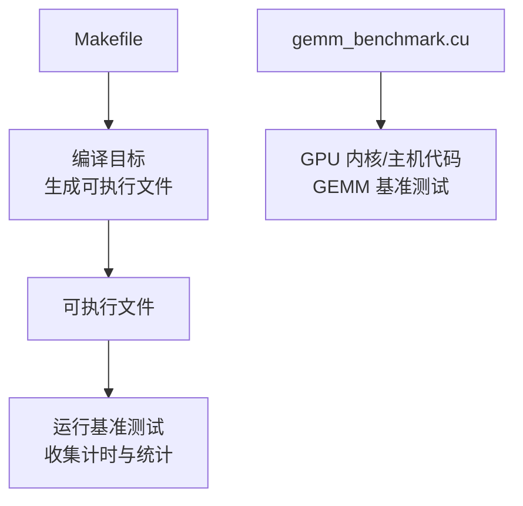
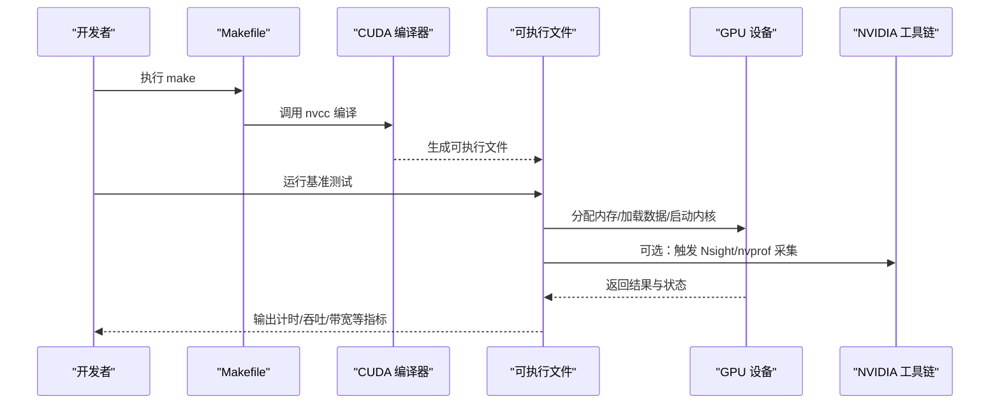
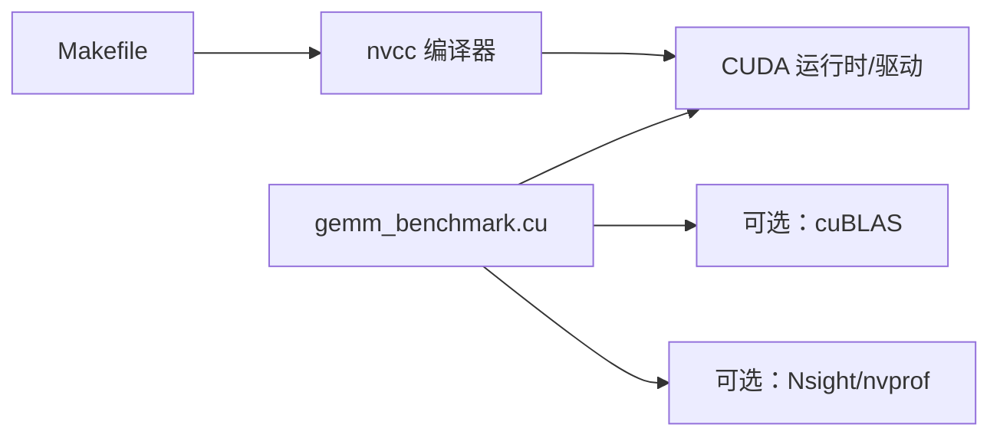

# 性能分析

<cite>
**本文引用的文件**   
- [Makefile](file://Makefile)
- [gemm_benchmark.cu](file://gemm_benchmark.cu)
</cite>

## 目录
1. [简介](#简介)
2. [项目结构](#项目结构)
3. [核心组件](#核心组件)
4. [架构总览](#架构总览)
5. [详细组件分析](#详细组件分析)
6. [依赖关系分析](#依赖关系分析)
7. [性能考量](#性能考量)
8. [故障排查指南](#故障排查指南)
9. [结论](#结论)
10. [附录](#附录)

## 简介
本文件面向 GEMM（通用矩阵乘法）实现的性能分析与调优，围绕执行时间、内存带宽利用率与计算吞吐量三大指标展开，结合不同矩阵规模下的表现给出优化策略。文档同时提供使用 NVIDIA 工具（如 Nsight Compute、nvprof）进行深度分析的步骤，并总结常见瓶颈的识别与解决方法，以及与 cuBLAS 等成熟实现的对比分析方法。

## 项目结构
本项目包含两个关键文件：构建脚本与基准测试程序。整体结构简洁，便于快速搭建与运行性能测量流程。

图表来源
- [Makefile:1-200](file://Makefile#L1-L200)
- [gemm_benchmark.cu:1-200](file://gemm_benchmark.cu#L1-L200)

章节来源
- [Makefile:1-200](file://Makefile#L1-L200)
- [gemm_benchmark.cu:1-200](file://gemm_benchmark.cu#L1-L200)

## 核心组件
- 构建系统（Makefile）
  - 负责 CUDA 编译器调用、编译选项、链接参数与目标产物管理。
  - 典型关注点：是否启用优化（如 -O3）、调试符号（-g）、设备代码优化（-Xptxas）、CUDA 版本与架构目标（-arch）。
- 基准测试程序（gemm_benchmark.cu）
  - 负责矩阵数据准备、GPU 内存分配、GEMM 内核启动、计时与结果验证。
  - 典型关注点：计时精度（cudaEvent）、批量迭代、不同矩阵规模（M/N/K）与数据类型（FP32/FP16/BF16）、错误处理与输出格式。

章节来源
- [Makefile:1-200](file://Makefile#L1-L200)
- [gemm_benchmark.cu:1-200](file://gemm_benchmark.cu#L1-L200)

## 架构总览
下图展示从构建到运行、再到性能数据采集的整体流程。该流程适用于大多数基于 CUDA 的 GEMM 基准测试。

图表来源
- [Makefile:1-200](file://Makefile#L1-L200)
- [gemm_benchmark.cu:1-200](file://gemm_benchmark.cu#L1-L200)

## 详细组件分析

### 构建系统（Makefile）
- 作用
  - 统一编译入口，确保在不同环境下的可重复构建。
  - 通过编译选项影响最终二进制体的性能特性（如优化级别、架构目标、PTXAS 选项）。
- 关键实践
  - 为发布构建启用最高优化等级；为调试构建保留符号信息。
  - 指定正确的 -arch 以匹配目标 GPU 架构，避免运行时 PTX 解释开销。
  - 合理设置 -Xptxas 选项，平衡寄存器占用与性能。
- 常见问题
  - 未指定 -arch 导致默认架构不匹配，性能下降。
  - 开启过多调试选项导致性能退化。
  - 未正确链接 CUDA 库或驱动版本不匹配。

章节来源
- [Makefile:1-200](file://Makefile#L1-L200)

### 基准测试程序（gemm_benchmark.cu）
- 作用
  - 组织 GEMM 基准测试流程：数据准备、GPU 资源管理、内核启动、计时与统计。
  - 支持多组矩阵规模与数据类型，便于横向对比。
- 关键实践
  - 使用 cudaEvent 进行高精度计时，避免 CPU/GPU 同步偏差。
  - 预热阶段（warm-up）稳定缓存与调度器，减少首次运行抖动。
  - 多次迭代取中位数或分位数，降低噪声影响。
  - 显式检查 CUDA API 返回值，及时捕获错误。
- 性能相关要点
  - 内存分配与数据传输应尽量避免在计时区间内发生。
  - 核函数启动参数（block/grid 维度）需根据 M/N/K 动态调整。
  - 对大矩阵优先保证 L2/L1 缓存命中率与合并访问。

章节来源
- [gemm_benchmark.cu:1-200](file://gemm_benchmark.cu#L1-L200)

### 性能指标定义与计算方法
- 执行时间
  - 含义：从内核启动到完成的时间，反映端到端延迟。
  - 方法：使用 cudaEventRecord/cudaEventSynchronize 包裹内核启动与等待。
  - 注意：剔除内存拷贝与初始化时间，仅统计计算时间。
- 内存带宽利用率
  - 含义：实际有效读写字节数除以理论峰值带宽，衡量访存效率。
  - 方法：统计 GEMM 读写总量（含 A/B/C 矩阵），除以执行时间与理论带宽。
  - 注意：考虑数据类型大小与冗余访问（如共享内存复用）。
- 计算吞吐量
  - 含义：单位时间内完成的浮点运算次数（GFLOPS/TFLOPS）。
  - 方法：按 GEMM 公式估算运算量（2*M*N*K），除以执行时间。
  - 注意：区分 FP32/FP16/BF16 的峰值与有效吞吐。

章节来源
- [gemm_benchmark.cu:1-200](file://gemm_benchmark.cu#L1-L200)

### 不同矩阵规模下的性能表现
- 小矩阵（M,N,K < 128）
  - 特点：计算量小，启动与调度开销占比高。
  - 现象：吞吐低，带宽利用率不足。
  - 策略：批处理、融合内核、减少主机-GPU 同步。
- 中等矩阵（128 ≤ M,N,K ≤ 1024）
  - 特点：缓存友好性开始显现，共享内存与寄存器重用效果明显。
  - 现象：吞吐上升，带宽利用率逐步提升。
  - 策略：优化分块大小、提高 L1/L2 命中率、减少 bank conflict。
- 大矩阵（M,N,K > 1024）
  - 特点：计算密集，受限于峰值算力与全局内存带宽。
  - 现象：吞吐接近峰值，带宽成为瓶颈。
  - 策略：最大化并行度、合并访问、利用 Tensor Core（若可用）。

章节来源
- [gemm_benchmark.cu:1-200](file://gemm_benchmark.cu#L1-L200)

### 使用 NVIDIA 工具进行深入分析
- Nsight Compute
  - 用途：核函数级性能剖析，包括指令吞吐、内存带宽、寄存器占用、线程束分化等。
  - 建议：针对热点核函数进行分析，关注 SM 利用率、L1/L2 命中率、访存模式。
- nvprof / Nsight Systems
  - 用途：应用级时序与事件统计，查看 API 调用、内核执行、内存传输。
  - 建议：定位耗时热点、发现同步阻塞、评估主机-GPU 交互开销。
- 常用指标
  - SM Active Cycles、Achieved Bandwidth、L1/L2 Hit Rate、Register Usage、Warp Execution Efficiency。

章节来源
- [gemm_benchmark.cu:1-200](file://gemm_benchmark.cu#L1-L200)

### 与其他 GEMM 实现（如 cuBLAS）的性能对比
- 对比维度
  - 执行时间、GFLOPS、带宽利用率、可扩展性（随规模增长）。
- 方法
  - 统一输入规模与数据类型，保持计时方式一致。
  - 记录峰值理论值（SM 算力、内存带宽）作为参考。
  - 绘制曲线图观察趋势差异，定位拐点与平台差异。
- 解读
  - 若自定义实现在小规模优于 cuBLAS，可能得益于更激进的批处理或融合策略。
  - 若大规模落后，需检查访存模式、缓存利用与并行度配置。

章节来源
- [gemm_benchmark.cu:1-200](file://gemm_benchmark.cu#L1-L200)

## 依赖关系分析
- 外部依赖
  - CUDA 运行时与驱动：提供 GPU 执行环境与 API。
  - 可选：cuBLAS（用于对比）、Nsight Compute/nvprof（用于分析）。
- 内部依赖
  - Makefile 依赖 nvcc 与 CUDA 工具链。
  - gemm_benchmark.cu 依赖 CUDA API 与可能的数学库。

图表来源
- [Makefile:1-200](file://Makefile#L1-L200)
- [gemm_benchmark.cu:1-200](file://gemm_benchmark.cu#L1-L200)

章节来源
- [Makefile:1-200](file://Makefile#L1-L200)
- [gemm_benchmark.cu:1-200](file://gemm_benchmark.cu#L1-L200)

## 性能考量
- 计时与稳定性
  - 使用 cudaEvent 精确计时，避免 CPU 侧 sleep 或轮询。
  - 预热后多次迭代，使用中位数或 95% 分位数报告。
- 内存访问模式
  - 合并访问、避免 bank conflict、充分利用共享内存。
  - 对齐与步长优化，减少碎片化访问。
- 并行度与资源占用
  - 合理设置 block/grid 维度，避免线程束分化。
  - 控制寄存器与共享内存占用，提高 SM 并发度。
- 数据类型与硬件特性
  - 在支持的 GPU 上启用 Tensor Core（FP16/BF16）。
  - 混合精度训练场景下注意数值稳定性与误差累积。
- 主机-GPU 交互
  - 最小化同步与数据传输，采用异步流与双缓冲。
  - 将 I/O 与计算重叠，隐藏延迟。

[本节为通用指导，无需特定文件引用]

## 故障排查指南
- 常见问题
  - 计时异常：未正确同步或事件未记录。
  - 内存错误：越界访问、未对齐、共享内存冲突。
  - 性能波动：未预热、系统负载干扰、驱动/固件版本不稳定。
- 排查步骤
  - 使用 cuda-memcheck 检测内存错误。
  - 使用 Nsight Compute 定位热点核函数与瓶颈指标。
  - 逐步简化问题规模，确认是否为规模相关的问题。
- 修复建议
  - 修正访问模式与边界条件。
  - 调整核函数参数与资源限制。
  - 固定随机种子与输入分布，确保可重复性。

章节来源
- [gemm_benchmark.cu:1-200](file://gemm_benchmark.cu#L1-L200)

## 结论
通过对执行时间、内存带宽利用率与计算吞吐量的系统化测量与分析，可以准确定位 GEMM 实现中的瓶颈并进行针对性优化。结合 NVIDIA 工具链与 cuBLAS 对比，能够形成闭环的性能调优流程，持续提升在不同矩阵规模下的性能表现。

[本节为总结性内容，无需特定文件引用]

## 附录
- 术语表
  - GEMM：通用矩阵乘法（C = A × B + C）。
  - GFLOPS/TFLOPS：每秒十亿/万亿次浮点运算。
  - 带宽利用率：实际有效访存字节数与理论峰值带宽之比。
- 参考命令（示例）
  - 构建：make
  - 运行：./benchmark_executable
  - 分析：nsys profile ./benchmark_executable
  - 核函数剖析：ncu --metrics achieved_bandwidth,sm_active_cycles ./benchmark_executable

[本节为补充信息，无需特定文件引用]