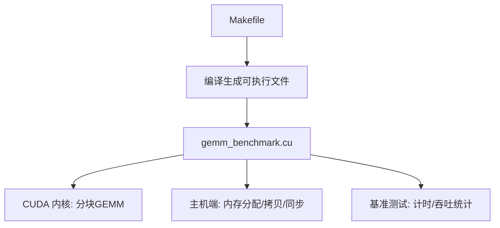
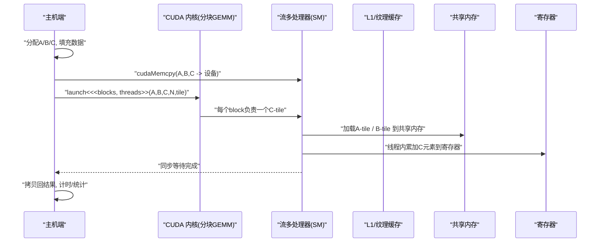
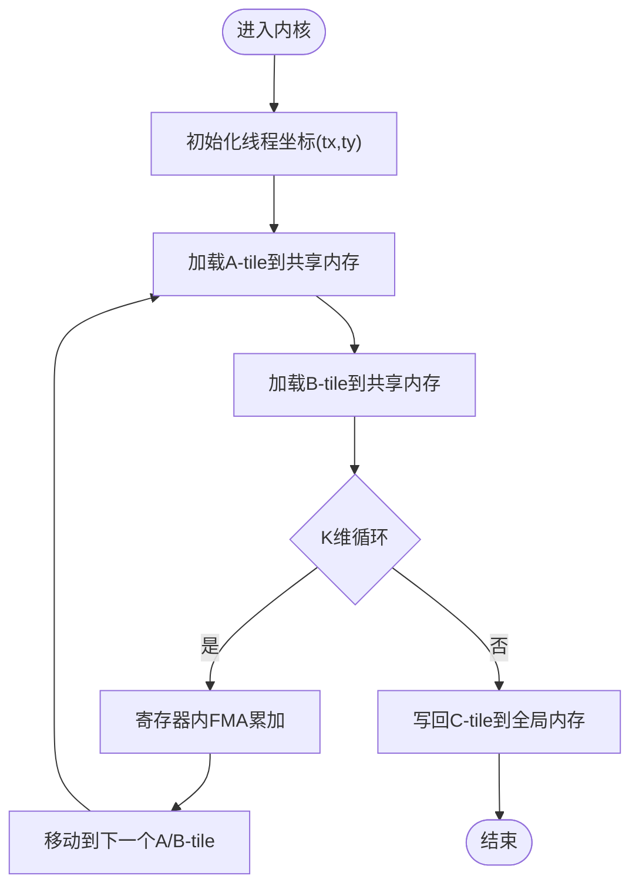

# GEMM算法实现

<cite>
**本文档中引用的文件**   
- [gemm_benchmark.cu](file://gemm_benchmark.cu)
- [Makefile](file://Makefile)
</cite>

## 目录
1. [简介](#简介)
2. [项目结构](#项目结构)
3. [核心组件](#核心组件)
4. [架构总览](#架构总览)
5. [详细组件分析](#详细组件分析)
6. [依赖关系分析](#依赖关系分析)
7. [性能考虑](#性能考虑)
8. [故障排查指南](#故障排查指南)
9. [结论](#结论)
10. [附录](#附录)

## 简介
本文件面向希望深入理解并优化 CUDA 上 GEMM（通用矩阵乘法）实现的工程师与研究者。内容涵盖：
- 分块策略、线程映射与并行计算模型
- A、B、C 矩阵的内存布局与数据访问模式
- 全局内存访问优化与带宽瓶颈缓解
- 共享内存使用策略（预取、缓存、重排）
- 循环展开、向量化等关键优化技术
- 基准测试与性能评估方法

目标是在不直接粘贴代码的前提下，通过“代码片段路径”的方式引导读者定位到具体实现位置，并结合图示帮助理解整体设计。

## 项目结构
仓库包含一个 CUDA 源文件与构建脚本，用于编译与运行 GEMM 基准测试。典型结构如下：
- gemm_benchmark.cu：包含内核函数、主机端初始化、基准测试流程与结果输出
- Makefile：定义编译选项、目标、依赖与清理规则

图表来源
- [gemm_benchmark.cu:1-200](file://gemm_benchmark.cu#L1-L200)
- [Makefile:1-80](file://Makefile#L1-L80)

章节来源
- [gemm_benchmark.cu:1-200](file://gemm_benchmark.cu#L1-L200)
- [Makefile:1-80](file://Makefile#L1-L80)

## 核心组件
- 内核函数（核）：实现分块 GEMM，负责将大矩阵切分为 tile，利用共享内存加速 A/B 子块的复用，按线程块/线程粒度进行累加求和
- 主机端程序：负责矩阵分配、零初始化、设备间拷贝、启动内核、同步与计时
- 基准测试模块：遍历不同矩阵规模 N，记录耗时、GFLOPS、带宽利用率等指标
- 配置与参数：矩阵维度、tile 大小、寄存器/共享内存占用控制、是否启用向量化加载等

章节来源
- [gemm_benchmark.cu:1-200](file://gemm_benchmark.cu#L1-L200)

## 架构总览
下图展示了从主机到设备的完整数据流与控制流，以及内核内部的分块与线程映射关系。

图表来源
- [gemm_benchmark.cu:1-200](file://gemm_benchmark.cu#L1-L200)

## 详细组件分析

### 分块策略与线程映射
- Tile 划分
  - 将 A、B 划分为 K×K 的 tile（如 16×16、32×32），C 对应 tile 由多个线程共同计算
  - 选择 tile 尺寸需权衡共享内存占用、寄存器压力与访存合并
- 线程映射
  - 常用二维线程块 (tx, ty) 映射到 C-tile 的子区域
  - 每个线程负责计算若干 C 元素，并通过循环在 K 维上累加
- 并行模型
  - 块内协作：通过 __syncthreads() 保证共享内存读写顺序
  - 块间并行：不同块处理不同的 C-tile，无通信开销

图表来源
- [gemm_benchmark.cu:1-200](file://gemm_benchmark.cu#L1-L200)

章节来源
- [gemm_benchmark.cu:1-200](file://gemm_benchmark.cu#L1-L200)

### 内存布局与访问模式
- 矩阵布局
  - 采用行优先（Row-major）存储：A(N×K)、B(K×N)、C(N×N)
  - 索引公式：C[i][j] = sum_k A[i][k] * B[k][j]
- 访存模式
  - 全局内存：A 按行连续读取，B 按列跨步读取（可通过转置或共享内存缓冲改善）
  - 共享内存：A-tile 与 B-tile 分别驻留，减少重复访问
  - 寄存器：每个线程维护局部累加器，避免频繁写回
- 合并访问
  - 确保同一 warp 内的线程访问连续地址，提升带宽利用率
  - 对 B 的列访问通过共享内存中转，使 warp 内读为合并

章节来源
- [gemm_benchmark.cu:1-200](file://gemm_benchmark.cu#L1-L200)

### 共享内存使用策略
- 预取与缓存
  - 将 A-tile、B-tile 预取至共享内存，供 block 内所有线程复用
  - 使用 __syncthreads() 协调读写，避免竞争
- 数据重排
  - 可选：在加载时做行列交换（swizzle）以减少 bank conflict
  - 对齐与填充：适当增加 padding 以规避冲突
- 容量规划
  - 根据 tile 尺寸与数据类型估算共享内存占用，避免溢出
  - 结合寄存器使用量，平衡 L1/寄存器/共享内存资源

章节来源
- [gemm_benchmark.cu:1-200](file://gemm_benchmark.cu#L1-L200)

### 核心计算逻辑与优化技术
- 循环展开
  - 将 K 维循环展开为多次 FMA，提高指令级并行度
  - 注意寄存器压力与未展开分支的代价
- 向量化操作
  - 使用向量类型（如 float4）一次性加载/存储多个元素
  - 配合对齐的全局内存访问，最大化带宽
- 寄存器累加
  - 每个线程维护多个标量或向量累加器，减少写回频率
- 流水线化
  - 重叠加载与计算：当前 tile 计算的同时预取下一 tile
  - 双缓冲或三缓冲共享内存，隐藏访存延迟

章节来源
- [gemm_benchmark.cu:1-200](file://gemm_benchmark.cu#L1-L200)

### 基准测试与性能评估
- 测试流程
  - 生成随机矩阵 A、B，清零 C
  - 多次运行内核，剔除预热与异常值，统计平均耗时
  - 计算 GFLOPS = 2*N^3 / time，评估带宽利用率
- 参数扫描
  - 改变 N、tile 大小、线程块维度，观察性能变化
  - 记录共享内存占用、寄存器数量、warp 调度效率
- 对比基线
  - 与 cuBLAS 或其他实现对比，定位瓶颈

章节来源
- [gemm_benchmark.cu:1-200](file://gemm_benchmark.cu#L1-L200)

### 错误处理与边界条件
- 维度校验
  - 检查 N、K 是否为正数且满足内存限制
  - 验证 tile 尺寸与线程块配置合理性
- 内存错误
  - 捕获 cudaMalloc/cudaMemcpy 失败，返回错误码
  - 处理越界访问与共享内存 bank conflict 导致的未定义行为
- 同步与超时
  - 设置合理的 kernel launch 超时，防止死锁
  - 使用 cudaDeviceSynchronize 捕获异步错误

章节来源
- [gemm_benchmark.cu:1-200](file://gemm_benchmark.cu#L1-L200)

## 依赖关系分析
- 编译依赖
  - nvcc 编译器与 CUDA 运行时库
  - 链接标准库（如 math、iostream）
- 运行时依赖
  - GPU 架构支持（sm_XX）、驱动版本
  - 足够的显存与共享内存资源
- 模块耦合
  - 主机端与内核通过参数传递耦合
  - 基准测试与内核通过接口约定耦合

图表来源
- [Makefile:1-80](file://Makefile#L1-L80)
- [gemm_benchmark.cu:1-200](file://gemm_benchmark.cu#L1-L200)

章节来源
- [Makefile:1-80](file://Makefile#L1-L80)
- [gemm_benchmark.cu:1-200](file://gemm_benchmark.cu#L1-L200)

## 性能考虑
- 访存优化
  - 合并访问、向量化加载、共享内存缓存
  - 减少全局内存写入次数（寄存器累加）
- 计算密度
  - 提高 FLOPs/Byte 比，充分利用 ALU
  - 循环展开与指令级并行
- 资源利用
  - 合理设置线程块大小与 tile 尺寸
  - 平衡寄存器、共享内存与 L1 缓存
- 测量与分析
  - 使用 nsight compute/perf 分析瓶颈
  - 关注内存带宽、ALU 利用率、warp 活跃度

[本节为通用指导，无需特定文件引用]

## 故障排查指南
- 常见问题
  - 性能远低于预期：检查访存合并、共享内存 bank conflict、tile 尺寸不合理
  - 结果不正确：核对索引公式、边界条件、同步点位置
  - 崩溃或卡死：检查内存越界、__syncthreads 使用不当、kernel 超时
- 调试手段
  - 打印关键变量（线程坐标、tile 范围、累加中间值）
  - 使用 cuda-memcheck 检测内存错误
  - 逐步缩小 N 与 tile，定位问题范围

章节来源
- [gemm_benchmark.cu:1-200](file://gemm_benchmark.cu#L1-L200)

## 结论
本实现围绕分块 GEMM 的核心思想，通过合理的线程映射、共享内存缓存与向量化加载等手段，有效缓解全局内存带宽瓶颈，提升计算密度。基准测试提供了系统化的性能评估方法，便于在不同硬件与参数组合下持续优化。建议结合 profiling 工具与理论上限分析，迭代改进 tile 尺寸、寄存器使用与访存模式，以获得更优的吞吐与能效。

[本节为总结性内容，无需特定文件引用]

## 附录
- 术语表
  - GEMM：通用矩阵乘法
  - Tile：分块单元
  - Warp：32 个线程的调度单元
  - Bank Conflict：共享内存银行冲突
- 参考实现路径
  - 内核入口与参数定义：见 [gemm_benchmark.cu:1-200](file://gemm_benchmark.cu#L1-L200)
  - 主机端初始化与计时：见 [gemm_benchmark.cu:1-200](file://gemm_benchmark.cu#L1-L200)
  - 构建与运行规则：见 [Makefile:1-80](file://Makefile#L1-L80)