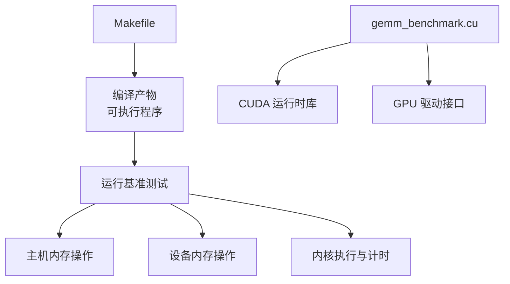
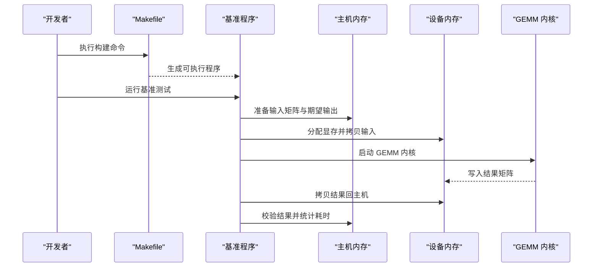
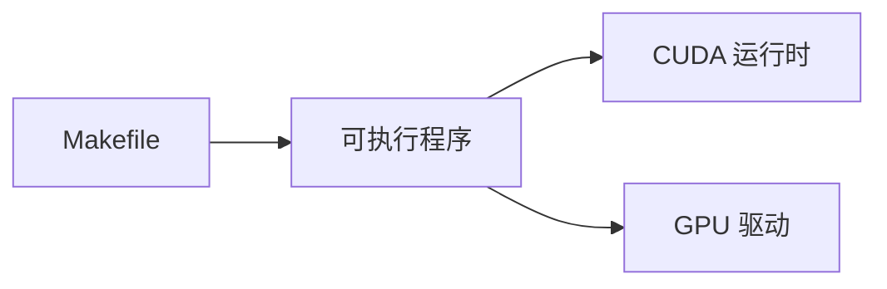

# 内存管理

<cite>
**本文引用的文件**   
- [Makefile](file://Makefile)
- [gemm_benchmark.cu](file://gemm_benchmark.cu)
</cite>

## 目录
1. [简介](#简介)
2. [项目结构](#项目结构)
3. [核心组件](#核心组件)
4. [架构总览](#架构总览)
5. [详细组件分析](#详细组件分析)
6. [依赖关系分析](#依赖关系分析)
7. [性能考量](#性能考量)
8. [故障排查指南](#故障排查指南)
9. [结论](#结论)
10. [附录](#附录)

## 简介
本文件围绕 CUDA GEMM 基准测试项目的内存管理进行系统化说明，重点覆盖：
- GPU 内存分配策略与优化（如 cudaMalloc、cudaMemcpy）
- 主机端与设备端数据传输机制（同步/异步传输、计算与传输重叠）
- 内存对齐要求及其对性能的影响
- 内存池技术与复用策略
- 内存泄漏检测与调试方法
- 最佳实践示例路径（批量数据传输、内存复用等）

本项目由一个 CUDA 源文件和一个构建脚本组成，适合用于理解在 GEMM 场景下的典型内存使用模式与优化思路。

## 项目结构
- Makefile：定义编译选项、目标与依赖，便于快速构建基准程序。
- gemm_benchmark.cu：实现 GEMM 基准测试的核心逻辑，包含矩阵生成、GPU 内存分配、内核执行、结果验证与计时等。

图表来源
- [Makefile](file://Makefile)
- [gemm_benchmark.cu](file://gemm_benchmark.cu)

章节来源
- [Makefile](file://Makefile)
- [gemm_benchmark.cu](file://gemm_benchmark.cu)

## 核心组件
- 主机端数据准备与校验：负责生成或加载输入矩阵、构造期望输出、对比结果正确性。
- 设备端内存管理：负责 GPU 显存分配、释放、拷贝与生命周期管理。
- 计算内核调用：触发 GEMM 内核执行，并配合流/事件实现异步与重叠。
- 计时与统计：记录各阶段耗时，评估带宽与吞吐。

章节来源
- [gemm_benchmark.cu](file://gemm_benchmark.cu)

## 架构总览
下图展示从构建到运行的整体流程，以及主机/设备之间的关键交互点。

图表来源
- [Makefile](file://Makefile)
- [gemm_benchmark.cu](file://gemm_benchmark.cu)

## 详细组件分析

### 主机端与设备端数据传输机制
- 同步传输
  - 使用标准拷贝 API 将主机数组与设备数组进行双向拷贝。
  - 优点：简单可靠；缺点：阻塞 CPU，无法与计算并行。
- 异步传输与重叠计算
  - 通过流与事件组织“拷贝-计算-拷贝”流水线，使传输与计算重叠，提升带宽利用率。
  - 建议按批次切分数据，利用多流并发减少空闲时间。
- 零拷贝与统一内存
  - 在特定场景下可使用统一内存简化编程模型，但需关注页迁移开销与访问模式。

章节来源
- [gemm_benchmark.cu](file://gemm_benchmark.cu)

### 内存分配策略与优化
- 分配粒度与次数
  - 避免频繁小对象分配，采用大块分配并按需切片，降低分配器开销。
- 对齐与布局
  - 确保矩阵行/列对齐以满足高带宽访问需求，必要时做填充。
- 预取与缓存
  - 合理组织数据布局以提升 L2/L1 缓存命中率，减少全局访存抖动。

章节来源
- [gemm_benchmark.cu](file://gemm_benchmark.cu)

### 内存池技术与复用策略
- 设计要点
  - 维护固定大小的块池，支持申请/归还；避免重复分配释放。
  - 结合任务生命周期，在批处理开始时统一分配，结束时统一释放。
- 适用场景
  - 多次运行相同规模 GEMM、在线推理服务、批处理作业。
- 注意事项
  - 防止碎片化，定期整理或重建池；监控池大小上限与回收时机。

章节来源
- [gemm_benchmark.cu](file://gemm_benchmark.cu)

### 内存对齐要求与性能影响
- 对齐原则
  - 保证指针与步长满足硬件总线宽度（如 128B 对齐），提高合并访问效率。
- 性能影响
  - 未对齐会导致非合并访存、带宽下降、延迟上升；对齐后可显著提升吞吐。
- 实践建议
  - 在数据结构中预留填充字节，调整循环边界与索引计算以维持对齐。

章节来源
- [gemm_benchmark.cu](file://gemm_benchmark.cu)

### 内存泄漏检测与调试方法
- 工具链
  - 使用内存检查工具定位未释放的分配、越界访问与竞态条件。
- 常见症状
  - 进程退出时报错、显存持续增长、性能异常波动。
- 调试步骤
  - 最小化复现用例、逐步注释代码定位问题、结合日志与断点观察生命周期。

章节来源
- [gemm_benchmark.cu](file://gemm_benchmark.cu)

### 最佳实践示例路径
- 批量数据传输
  - 将多个小拷贝合并为一次大拷贝，减少 API 调用与调度开销。
  - 参考路径：[批量数据传输实现位置](file://gemm_benchmark.cu)
- 内存复用
  - 在循环内复用已分配的缓冲区，避免重复分配释放。
  - 参考路径：[内存复用实现位置](file://gemm_benchmark.cu)
- 异步流水线
  - 使用多流与事件编排“拷贝-计算-拷贝”，最大化资源利用率。
  - 参考路径：[异步流水线实现位置](file://gemm_benchmark.cu)

章节来源
- [gemm_benchmark.cu](file://gemm_benchmark.cu)

## 依赖关系分析
- 构建期依赖
  - Makefile 指定编译器、链接选项与目标文件，确保正确生成可执行程序。
- 运行期依赖
  - 基准程序依赖 CUDA 运行时库与 GPU 驱动，完成内存分配、拷贝与内核执行。

图表来源
- [Makefile](file://Makefile)
- [gemm_benchmark.cu](file://gemm_benchmark.cu)

章节来源
- [Makefile](file://Makefile)
- [gemm_benchmark.cu](file://gemm_benchmark.cu)

## 性能考量
- 带宽瓶颈
  - 优先优化主机-设备带宽利用率，减少不必要的往返拷贝。
- 计算-传输重叠
  - 通过流与事件隐藏拷贝延迟，提升整体吞吐。
- 访存模式
  - 合并访问、避免 bank conflict、合理使用共享内存。
- 资源复用
  - 减少分配/释放频率，降低系统调用与锁竞争。

## 故障排查指南
- 常见问题
  - 显存不足：检查分配总量与峰值，适当分批或缩小规模。
  - 结果不正确：核对数据布局、步长与拷贝顺序。
  - 性能不达标：检查是否充分利用带宽、是否存在串行拷贝。
- 定位手段
  - 启用运行时错误检查、打印关键阶段耗时、绘制时序图辅助分析。

章节来源
- [gemm_benchmark.cu](file://gemm_benchmark.cu)

## 结论
通过对该 GEMM 基准项目的内存管理进行分析，可以总结出以下关键点：
- 合理的分配与复用策略是稳定与高性能的基础。
- 异步传输与计算重叠能显著提升带宽利用率。
- 严格的数据对齐与布局优化对访存性能至关重要。
- 借助工具与系统化调试方法，可有效定位与修复内存相关问题。

## 附录
- 术语表
  - 主机端：CPU 侧内存空间
  - 设备端：GPU 显存空间
  - 流/事件：CUDA 异步执行与同步原语
  - 合并访问：连续线程访问连续地址，提升带宽效率
- 参考路径
  - 构建配置：[Makefile](file://Makefile)
  - 核心实现：[gemm_benchmark.cu](file://gemm_benchmark.cu)