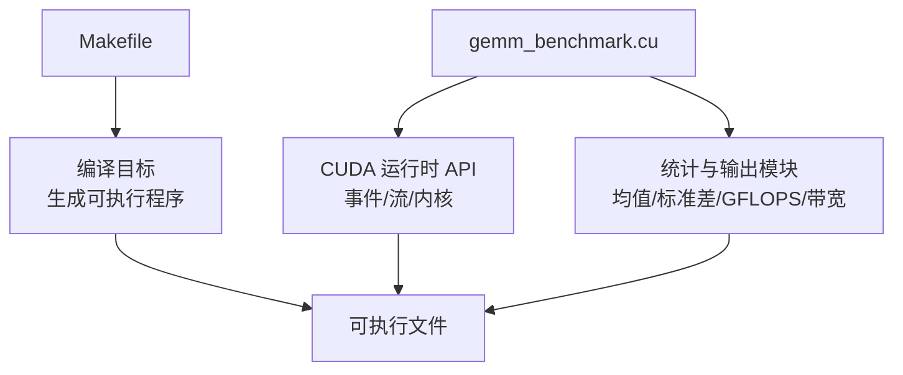
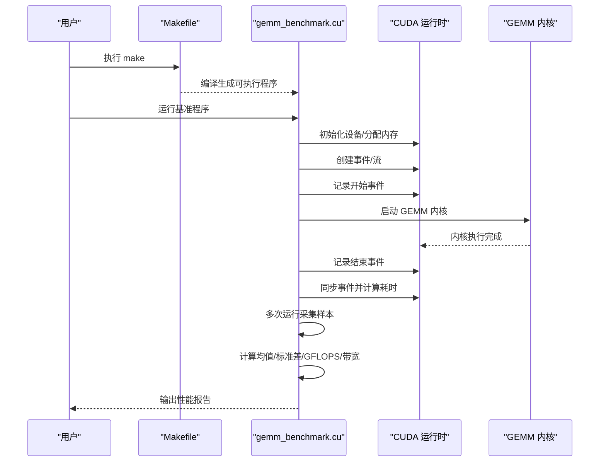
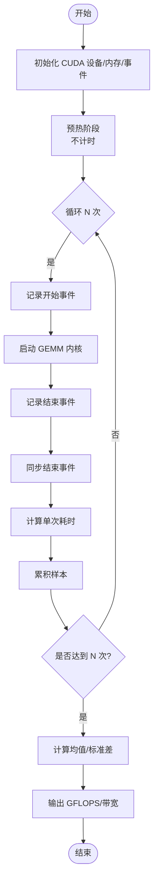
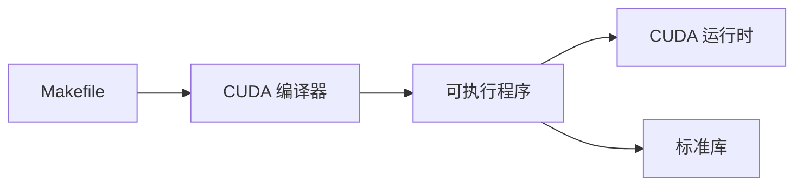

# 性能测量

<cite>
**本文引用的文件**   
- [Makefile](file://Makefile)
- [gemm_benchmark.cu](file://gemm_benchmark.cu)
</cite>

## 目录
1. [简介](#简介)
2. [项目结构](#项目结构)
3. [核心组件](#核心组件)
4. [架构总览](#架构总览)
5. [详细组件分析](#详细组件分析)
6. [依赖关系分析](#依赖关系分析)
7. [性能考量](#性能考量)
8. [故障排查指南](#故障排查指南)
9. [结论](#结论)
10. [附录](#附录)

## 简介
本文件面向 CUDA 内核性能测量与基准测试，聚焦于使用 CUDA 事件（cudaEventRecord、cudaEventSynchronize）进行精确计时，避免预热与同步开销对结果的影响。文档涵盖：
- 内核执行时间的准确测量方法
- 吞吐量的计算方式（GFLOPS、内存带宽）
- 性能统计数据的收集与分析流程
- 基准测试最佳实践（多次运行、均值与标准差）
- 基于本项目代码的性能测量框架实现要点与示例路径

## 项目结构
仓库包含两个关键文件：
- Makefile：构建脚本，用于编译 CUDA 基准程序
- gemm_benchmark.cu：GEMM 基准测试主程序，包含 CUDA 事件计时、内核调用、统计与输出

图表来源
- [Makefile:1-200](file://Makefile#L1-L200)
- [gemm_benchmark.cu:1-200](file://gemm_benchmark.cu#L1-L200)

章节来源
- [Makefile:1-200](file://Makefile#L1-L200)
- [gemm_benchmark.cu:1-200](file://gemm_benchmark.cu#L1-L200)

## 核心组件
- CUDA 事件计时器
  - 使用 cudaEventRecord 在关键位置记录时间戳
  - 使用 cudaEventSynchronize 确保事件完成并获取耗时
- GEMM 内核调度
  - 通过流或默认流调度内核，保证时序正确性
- 统计与报告
  - 多次运行采集时间样本，计算均值与标准差
  - 根据矩阵规模与时间计算 GFLOPS 与内存带宽

章节来源
- [gemm_benchmark.cu:1-200](file://gemm_benchmark.cu#L1-L200)

## 架构总览
下图展示了从构建到运行、再到性能数据输出的整体流程，以及 CUDA 事件在内核执行前后的插入点。

图表来源
- [Makefile:1-200](file://Makefile#L1-L200)
- [gemm_benchmark.cu:1-200](file://gemm_benchmark.cu#L1-L200)

## 详细组件分析

### CUDA 事件计时机制
- 关键点
  - 在启动内核前记录开始事件
  - 在启动内核后记录结束事件
  - 使用 cudaEventSynchronize 等待结束事件完成，再计算时间差
- 注意事项
  - 避免将主机端 I/O 或额外同步放入计时区间
  - 使用流隔离不同阶段的执行，减少隐式同步影响
  - 预热阶段不计入统计，确保 GPU 状态稳定

图表来源
- [gemm_benchmark.cu:1-200](file://gemm_benchmark.cu#L1-L200)

章节来源
- [gemm_benchmark.cu:1-200](file://gemm_benchmark.cu#L1-L200)

### 吞吐量计算方法
- GFLOPS
  - 公式：GFLOPS = (2 × M × N × K) / (时间秒 × 1e9)
  - 其中 M、N、K 为 GEMM 的维度；乘以 2 是因为乘加操作计数
- 内存带宽
  - 读取总量：A(M×K) + B(K×N)
  - 写入总量：C(M×N)
  - 总字节数 = (M×K + K×N + M×N) × sizeof(元素类型)
  - 带宽 = 总字节数 / 时间秒
- 精度与单位
  - 时间以毫秒为单位时需转换为秒
  - 注意数据类型大小（如 float=4 字节）

章节来源
- [gemm_benchmark.cu:1-200](file://gemm_benchmark.cu#L1-L200)

### 性能统计数据的收集与分析
- 数据采集
  - 多次运行（建议至少 10 次），剔除异常值（可选）
  - 记录每次的内核执行时间（毫秒）
- 统计分析
  - 均值：反映典型性能
  - 标准差：衡量波动程度，评估稳定性
- 可视化与导出
  - 输出 CSV/JSON 便于后续分析
  - 绘制箱线图观察分布

章节来源
- [gemm_benchmark.cu:1-200](file://gemm_benchmark.cu#L1-L200)

### 避免预热与同步开销的最佳实践
- 预热
  - 首次运行前执行一次“空跑”，使驱动加载、缓存预热
  - 预热阶段不计入统计
- 同步
  - 仅在必要时使用 cudaDeviceSynchronize，避免阻塞
  - 使用事件与流管理时序，减少隐式同步
- 隔离
  - 将 I/O、日志打印放在计时区间外
  - 使用独立流隔离不同任务

章节来源
- [gemm_benchmark.cu:1-200](file://gemm_benchmark.cu#L1-L200)

### 具体代码示例与实现要点
- 事件创建与记录
  - 在计时区间前后分别调用事件记录函数
  - 参考路径：[gemm_benchmark.cu:1-200](file://gemm_benchmark.cu#L1-L200)
- 内核启动与流管理
  - 使用流参数启动内核，确保顺序与异步执行
  - 参考路径：[gemm_benchmark.cu:1-200](file://gemm_benchmark.cu#L1-L200)
- 统计与输出
  - 计算均值、标准差、GFLOPS、带宽并输出
  - 参考路径：[gemm_benchmark.cu:1-200](file://gemm_benchmark.cu#L1-L200)

章节来源
- [gemm_benchmark.cu:1-200](file://gemm_benchmark.cu#L1-L200)

## 依赖关系分析
- 构建依赖
  - Makefile 负责编译选项、链接库与目标生成
- 运行时依赖
  - CUDA 运行时 API（事件、流、内核）
  - 标准库用于统计与格式化输出

图表来源
- [Makefile:1-200](file://Makefile#L1-L200)
- [gemm_benchmark.cu:1-200](file://gemm_benchmark.cu#L1-L200)

章节来源
- [Makefile:1-200](file://Makefile#L1-L200)
- [gemm_benchmark.cu:1-200](file://gemm_benchmark.cu#L1-L200)

## 性能考量
- 事件精度
  - 使用高精度事件，避免系统时钟抖动
- 采样数量
  - 增加样本数量以降低方差，提高置信度
- 资源占用
  - 避免内存碎片与频繁分配释放
- 平台差异
  - 不同 GPU 架构与驱动版本可能影响结果一致性

## 故障排查指南
- 常见问题
  - 事件未同步导致时间偏小
  - 预热不足导致首测时间偏大
  - 主机端 I/O 混入计时区间
- 诊断步骤
  - 检查事件记录与同步调用位置
  - 分离 I/O 与计时区间
  - 增加样本数量并观察标准差
- 定位工具
  - 使用 CUDA 调试工具验证内核启动顺序
  - 检查返回值与错误码

章节来源
- [gemm_benchmark.cu:1-200](file://gemm_benchmark.cu#L1-L200)

## 结论
通过合理使用 CUDA 事件与流，结合多次运行与统计分析，可以获得稳定可靠的 GEMM 性能指标。遵循预热、隔离与最小同步的原则，能够避免常见误差来源，提升测量准确性。

## 附录
- 术语
  - GFLOPS：每秒十亿次浮点运算
  - 内存带宽：每秒传输的字节数
- 参考路径
  - 事件计时与统计实现：[gemm_benchmark.cu:1-200](file://gemm_benchmark.cu#L1-L200)
  - 构建配置：[Makefile:1-200](file://Makefile#L1-L200)