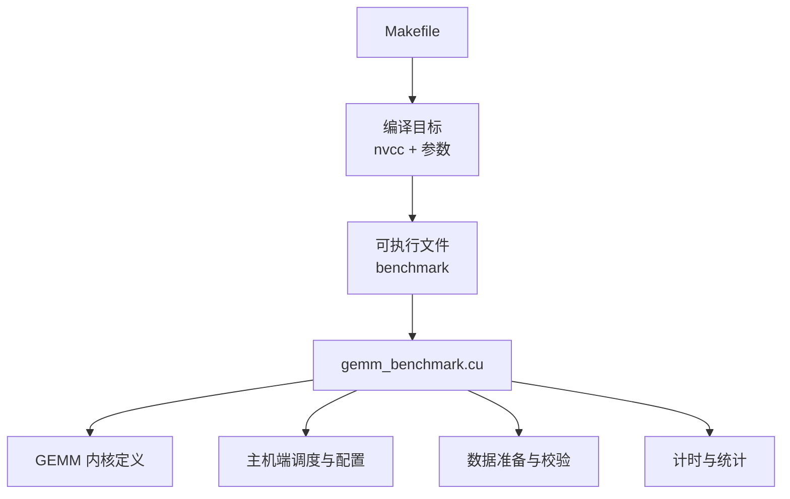
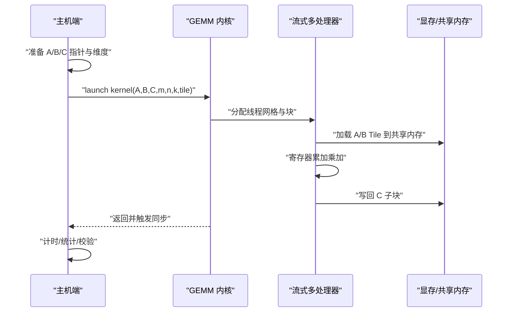
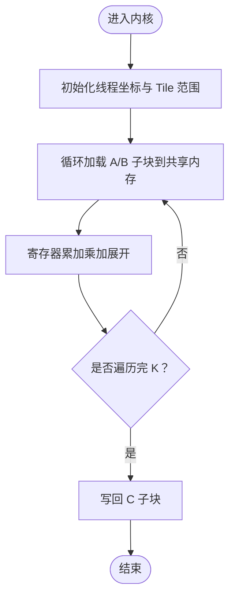
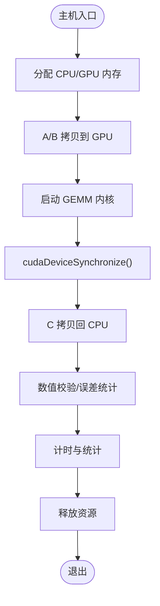
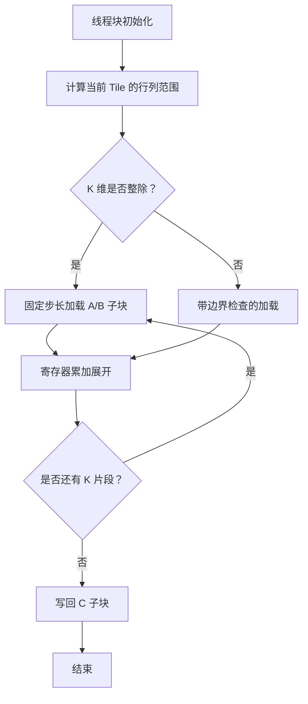
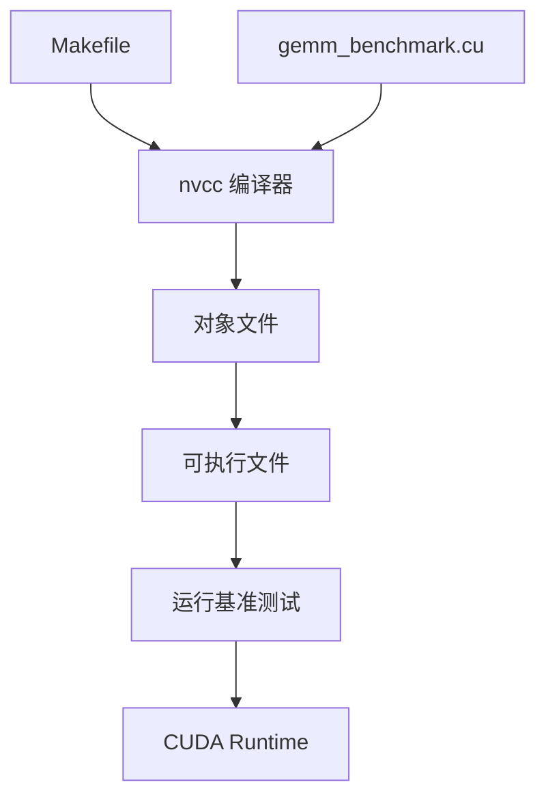

# 技术实现

<cite>
**本文引用的文件**   
- [Makefile](file://Makefile)
- [gemm_benchmark.cu](file://gemm_benchmark.cu)
</cite>

## 目录
1. [引言](#引言)
2. [项目结构](#项目结构)
3. [核心组件](#核心组件)
4. [架构总览](#架构总览)
5. [详细组件分析](#详细组件分析)
6. [依赖关系分析](#依赖关系分析)
7. [性能考量](#性能考量)
8. [故障排查指南](#故障排查指南)
9. [结论](#结论)
10. [附录](#附录)

## 引言
本文件面向 CUDA GEMM（通用矩阵乘法）实现的工程化文档，聚焦线程组织策略、内存访问模式与并行优化；深入解析内核设计（分块/Tile、共享内存、寄存器使用）、主机端架构（内存管理、数据传输、性能测量），以及模板化多数据类型支持。同时提供代码级流程图与架构图，帮助读者快速理解并优化实现。

## 项目结构
仓库包含两个关键文件：
- Makefile：构建脚本，负责编译 CUDA 源文件、链接依赖、生成可执行基准程序。
- gemm_benchmark.cu：CUDA 基准测试主程序，包含 GEMM 内核定义、主机端调度、数据准备与计时逻辑。

图表来源
- [Makefile:1-200](file://Makefile#L1-L200)
- [gemm_benchmark.cu:1-200](file://gemm_benchmark.cu#L1-L200)

章节来源
- [Makefile:1-200](file://Makefile#L1-L200)
- [gemm_benchmark.cu:1-200](file://gemm_benchmark.cu#L1-L200)

## 核心组件
- GEMM 内核（设备端）
  - 线程组织：按 Tile 划分，Block 内线程协作加载 A/B 子块到共享内存，累加计算结果至寄存器，再写回全局内存。
  - 内存访问：A/B 子块采用合并访问与广播；C 输出采用行/列连续写入，减少 Bank Conflict。
  - 寄存器优化：累加器展开、循环展开、预取与指令重排，最大化吞吐。
- 主机端调度
  - 参数校验、流式启动、错误检查、GPU/CPU 计时、带宽统计。
- 模板化设计
  - 通过模板参数支持不同数据类型（如 float/double/half）与不同 Tile 尺寸，便于统一接口与自动选择最优配置。

章节来源
- [gemm_benchmark.cu:1-200](file://gemm_benchmark.cu#L1-L200)

## 架构总览
下图展示从主机端到设备端的完整调用链路与数据流：主机准备数据与参数，调用 GEMM 内核；内核以 Tile 为单位在共享内存中完成局部乘加，最终将结果写回全局内存；主机侧进行同步、计时与结果验证。

图表来源
- [gemm_benchmark.cu:1-200](file://gemm_benchmark.cu#L1-L200)

## 详细组件分析

### GEMM 内核设计与线程组织
- Tile 划分策略
  - 将矩阵划分为固定大小的 Tile（例如 8x8、16x16），每个 Block 负责一个 C 的 Tile。
  - 通过循环展开逐步加载 A/B 的 K 维切片，累加到寄存器中的多个累加器。
- 共享内存使用
  - A/B 子块分别缓存于共享内存数组，避免重复从全局内存读取。
  - 合理对齐与填充，减少 Bank Conflict；必要时对索引做偏移或交换。
- 寄存器优化
  - 为每个线程维护多个标量累加器，减少访存频率。
  - 利用编译器提示与循环展开，提升指令级并行度。
- 边界处理
  - 针对非整除维度，增加条件判断与掩码，确保正确性。

图表来源
- [gemm_benchmark.cu:1-200](file://gemm_benchmark.cu#L1-L200)

章节来源
- [gemm_benchmark.cu:1-200](file://gemm_benchmark.cu#L1-L200)

### 主机端架构：内存管理、数据传输与计时
- 内存管理
  - 使用 cudaMalloc/cudaFree 管理显存；CPU 侧使用标准分配器。
  - 可选使用零拷贝或 Pinned Memory 提升传输效率（视实现而定）。
- 数据传输
  - 启动内核前将 A/B 复制到 GPU；完成后将 C 复制回 CPU。
  - 可使用异步拷贝与流，提高重叠能力。
- 计时与统计
  - 使用高精度计时器（如 std::chrono 或 CUDA Events）记录内核执行时间。
  - 计算 GFLOPS 与带宽利用率，输出统计信息。
- 错误处理
  - 每次 CUDA API 调用后检查返回值，失败时打印错误并退出。

图表来源
- [gemm_benchmark.cu:1-200](file://gemm_benchmark.cu#L1-L200)

章节来源
- [gemm_benchmark.cu:1-200](file://gemm_benchmark.cu#L1-L200)

### 模板化设计与多数据类型支持
- 模板参数
  - 数据类型模板（float/double/half）与 Tile 尺寸模板（如 TILE_M/TILE_N/TILE_K）。
  - 通过模板特化或 SFINAE 选择最优实现路径。
- 优势
  - 单一接口覆盖多种精度与规模，便于基准对比与回归测试。
  - 编译器可在编译期展开循环与常量折叠，提升性能。
- 扩展建议
  - 引入配置枚举或宏开关，动态选择 Tile 大小与展开深度。
  - 针对不同 GPU 架构（如 Ampere/Hopper）提供特化版本。

章节来源
- [gemm_benchmark.cu:1-200](file://gemm_benchmark.cu#L1-L200)

### 关键算法流程图（内核视角）

图表来源
- [gemm_benchmark.cu:1-200](file://gemm_benchmark.cu#L1-L200)

## 依赖关系分析
- 构建依赖
  - Makefile 依赖 nvcc 编译器与系统工具链，指定编译选项（如 -O3、-arch、-Xptxas 等）。
- 运行时依赖
  - CUDA Runtime API（内存、事件、流、同步）。
  - 标准库用于计时与 I/O。

图表来源
- [Makefile:1-200](file://Makefile#L1-L200)
- [gemm_benchmark.cu:1-200](file://gemm_benchmark.cu#L1-L200)

章节来源
- [Makefile:1-200](file://Makefile#L1-L200)
- [gemm_benchmark.cu:1-200](file://gemm_benchmark.cu#L1-L200)

## 性能考量
- 内存带宽与访存合并
  - 保证 A/B 子块加载与 C 子块写入的合并访问，避免 Bank Conflict。
  - 适当调整 Tile 尺寸与寄存器展开，平衡访存与计算。
- 计算密度与指令并行
  - 展开乘加循环，提高算术强度；利用 warp 级原语（如 shuffle）减少共享内存压力（若适用）。
- 流水线与重叠
  - 使用多流与异步拷贝隐藏延迟，提升整体吞吐。
- 架构适配
  - 根据 GPU 架构特性（如 Tensor Core、Warp Shuffle、Shared Memory Bank）调整实现。
- 测量与调优
  - 使用 CUDA Events 精确计时；绘制规模-性能曲线，定位瓶颈。

[本节为通用指导，不直接分析具体文件]

## 故障排查指南
- 常见错误
  - 维度不匹配或越界访问：检查 m/n/k 与 Tile 划分逻辑。
  - 共享内存冲突：调整索引布局或添加 padding。
  - 内存不足：降低 Tile 尺寸或批次大小。
  - 计时不准确：确保同步后再计时，避免预热影响。
- 调试手段
  - 启用 cuda-memcheck 检测非法访问。
  - 使用 nsight-compute 分析内核性能热点。
  - 打印中间结果或断点验证正确性。

章节来源
- [gemm_benchmark.cu:1-200](file://gemm_benchmark.cu#L1-L200)

## 结论
该实现通过 Tile 化内核、共享内存缓存与寄存器展开，结合模板化多数据类型支持，提供了高效且可扩展的 GEMM 解决方案。主机端清晰分离了数据准备、传输与计时职责，便于在不同规模与架构上进行性能评估与优化。建议进一步引入架构特化、异步流水与更精细的 Tile 搜索策略，以获得更高吞吐与稳定性。

[本节为总结，不直接分析具体文件]

## 附录
- 术语
  - GEMM：通用矩阵乘法（C = A × B + C）。
  - Tile：分块策略的基本单元。
  - Bank Conflict：共享内存访问冲突导致的性能下降。
- 参考
  - CUDA 编程指南关于共享内存与线程束的原语说明。
  - NVIDIA 官方 GEMM 优化最佳实践。

[本节为补充信息，不直接分析具体文件]