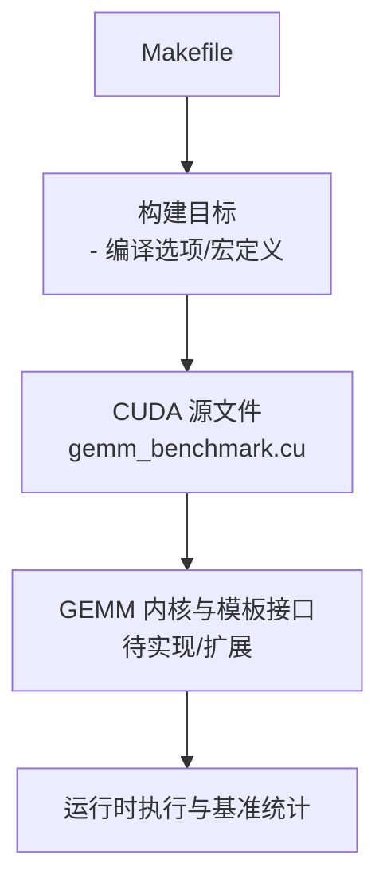
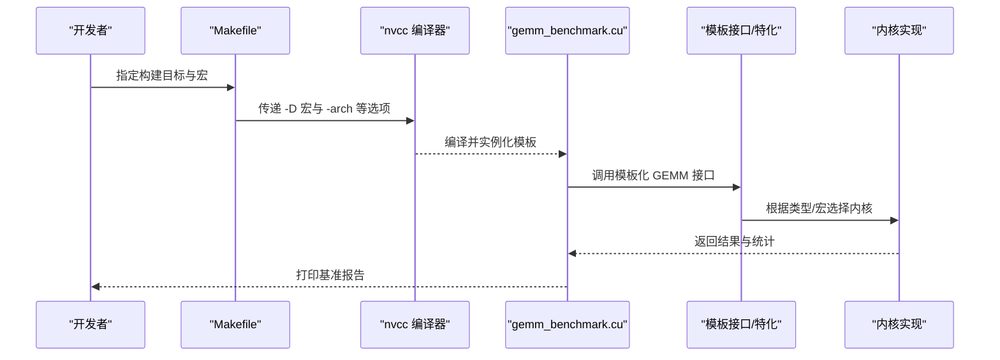
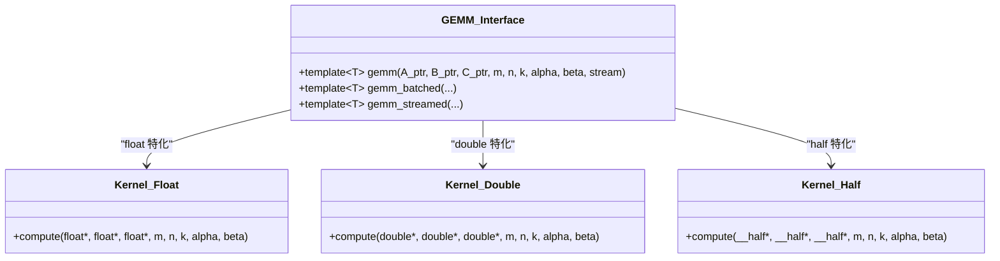
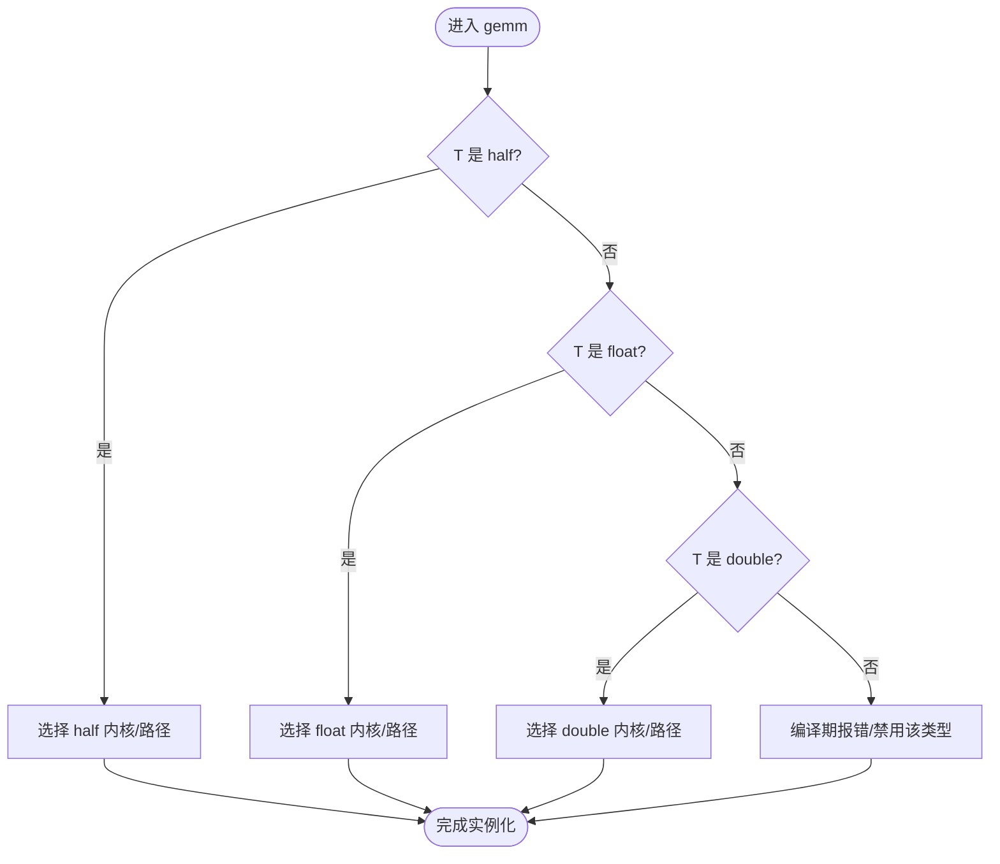
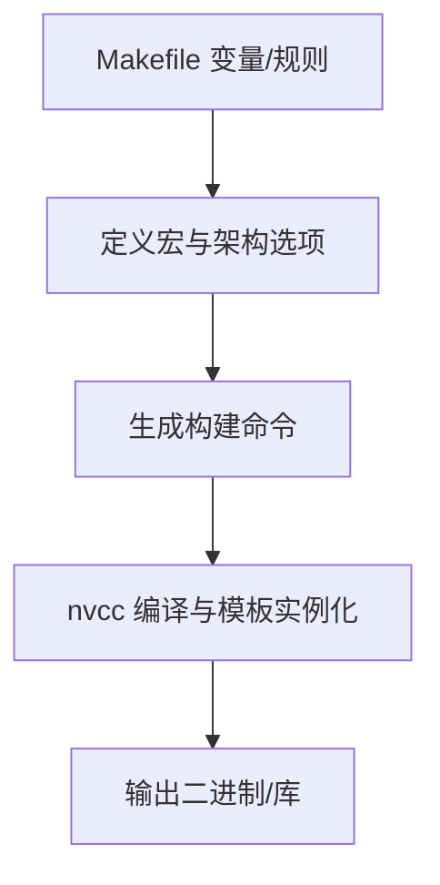
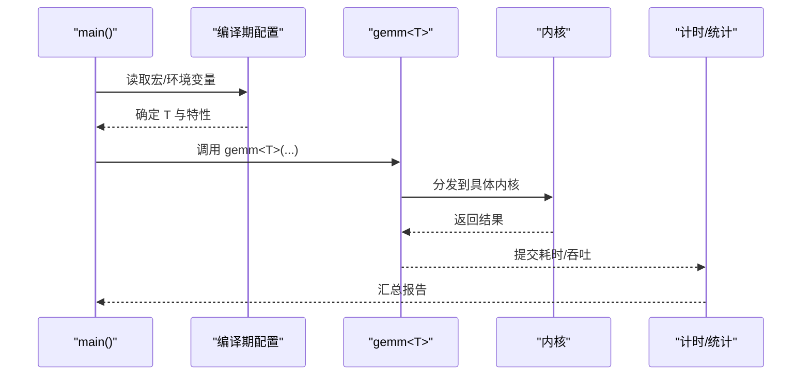

# 模板化设计

<cite>
**本文引用的文件**   
- [Makefile](file://Makefile)
- [gemm_benchmark.cu](file://gemm_benchmark.cu)
</cite>

## 目录
1. [简介](#简介)
2. [项目结构](#项目结构)
3. [核心组件](#核心组件)
4. [架构总览](#架构总览)
5. [详细组件分析](#详细组件分析)
6. [依赖分析](#依赖分析)
7. [性能考虑](#性能考虑)
8. [故障排查指南](#故障排查指南)
9. [结论](#结论)
10. [附录](#附录)

## 简介
本设计文档聚焦于在 GEMM（通用矩阵乘法）实现中如何运用 C++/CUDA 模板技术，达成数据类型泛型化与编译时优化。目标包括：
- 通过模板参数支持 float、double、half 等数据类型
- 合理使用模板特化与 SFINAE/Concepts 思想提升表达力与性能
- 利用模板元编程进行编译期配置与路径选择
- 给出可复用的模板函数设计与调用范式
- 结合 Makefile 的编译选项与条件编译，构建多精度、多后端版本

说明：当前仓库仅包含 Makefile 与一个 CUDA 基准程序入口。本文基于这些文件进行模板化设计的整体规划与落地建议，并在需要处引用具体文件位置。

## 项目结构
仓库采用极简结构：
- Makefile：负责构建流程、编译器选项、目标生成与并行编译
- gemm_benchmark.cu：CUDA 基准测试入口，用于驱动不同精度的 GEMM 内核并输出性能数据

图表来源
- [Makefile:1-200](file://Makefile#L1-L200)
- [gemm_benchmark.cu:1-200](file://gemm_benchmark.cu#L1-L200)

章节来源
- [Makefile:1-200](file://Makefile#L1-L200)
- [gemm_benchmark.cu:1-200](file://gemm_benchmark.cu#L1-L200)

## 核心组件
围绕模板化的 GEMM 实现，核心组件包括：
- 模板化 GEMM 接口：以类型参数 T 驱动不同精度计算
- 内核适配层：根据 T 选择最优内核实现（如半精度专用路径）
- 编译期配置：通过宏控制是否启用特定精度或特性
- 基准驱动：在入口处按配置实例化并运行对应精度

章节来源
- [gemm_benchmark.cu:1-200](file://gemm_benchmark.cu#L1-L200)
- [Makefile:1-200](file://Makefile#L1-L200)

## 架构总览
下图展示从构建到运行的模板化路径选择与数据流。

图表来源
- [Makefile:1-200](file://Makefile#L1-L200)
- [gemm_benchmark.cu:1-200](file://gemm_benchmark.cu#L1-L200)

## 详细组件分析

### 模板化 GEMM 接口设计
- 使用模板参数 T 表示数据类型，典型取值 float、double、__half
- 提供统一 API：例如 gemm<T>(A, B, C, m, n, k, alpha, beta, ...)
- 内部根据 T 分派至不同内核或向量化路径
- 借助 constexpr/if constexpr 在编译期裁剪分支

图表来源
- [gemm_benchmark.cu:1-200](file://gemm_benchmark.cu#L1-L200)

章节来源
- [gemm_benchmark.cu:1-200](file://gemm_benchmark.cu#L1-L200)

### 模板特化与条件编译
- 针对 half 精度可使用显式特化或 if constexpr 分支，避免运行时判断
- 对不支持的类型可通过 SFINAE 或概念约束阻止错误实例化
- 通过宏开关（如 ENABLE_HALF、ENABLE_DOUBLE）控制编译产物规模

图表来源
- [gemm_benchmark.cu:1-200](file://gemm_benchmark.cu#L1-L200)

章节来源
- [gemm_benchmark.cu:1-200](file://gemm_benchmark.cu#L1-L200)

### 模板元编程在性能优化中的作用
- 编译期常量折叠：将维度对齐、块大小等作为非类型模板参数，消除运行时开销
- 内联与展开：constexpr 与模板递归展开减少分支与循环开销
- 策略模式：以模板参数注入算法策略（如分块策略、归约策略），由编译器选择最优实现
- 类型特征：std::is_floating_point、std::rank 等用于静态断言与路径选择

章节来源
- [gemm_benchmark.cu:1-200](file://gemm_benchmark.cu#L1-L200)

### 编译时配置与 Makefile 集成
- 通过 -D 宏控制精度与特性开关（如 -DENABLE_HALF=1）
- 针对不同 GPU 架构设置 -arch，使编译器生成更优指令
- 使用并行编译加速构建（-j 选项）
- 目标分层：分别构建 float/double/half 的可执行文件或库

图表来源
- [Makefile:1-200](file://Makefile#L1-L200)

章节来源
- [Makefile:1-200](file://Makefile#L1-L200)

### 基准驱动的模板调用范式
- 在 gemm_benchmark.cu 中，依据编译宏选择实例化类型 T
- 构造输入矩阵与流，调用模板化 gemm<T>
- 收集时间、吞吐与误差指标，输出报告

图表来源
- [gemm_benchmark.cu:1-200](file://gemm_benchmark.cu#L1-L200)

章节来源
- [gemm_benchmark.cu:1-200](file://gemm_benchmark.cu#L1-L200)

## 依赖分析
- 构建期依赖：Makefile 决定 nvcc 选项、宏与目标
- 编译期依赖：模板实例化与宏共同决定最终代码路径
- 运行期依赖：GPU 架构与驱动能力影响实际性能

图表来源
- [Makefile:1-200](file://Makefile#L1-L200)
- [gemm_benchmark.cu:1-200](file://gemm_benchmark.cu#L1-L200)

章节来源
- [Makefile:1-200](file://Makefile#L1-L200)
- [gemm_benchmark.cu:1-200](file://gemm_benchmark.cu#L1-L200)

## 性能考虑
- 类型选择：half 通常吞吐更高但数值范围受限；double 精度最高但带宽与算力压力大
- 内存布局：优先行主序或列主序一致性，减少转置与拷贝
- 分块与流水线：合理选择 tile 大小与寄存器占用，提高 SM 利用率
- 归约优化：使用 warp-level 原语与共享内存做高效归约
- 编译优化：开启 -O3、-use_fast_math（谨慎）、-Xptxas -O3 等

[本节为通用指导，不直接分析具体文件]

## 故障排查指南
- 编译期类型错误：检查模板参数与 SFINAE/概念约束是否正确限制类型
- 宏未生效：确认 Makefile 中的 -D 宏正确传递至 nvcc
- 架构不匹配：确保 -arch 与目标 GPU 一致
- 精度差异：对比 float/double/half 的结果误差是否在容忍范围内
- 性能异常：检查是否误选了次优内核路径或存在不必要的拷贝/同步

章节来源
- [Makefile:1-200](file://Makefile#L1-L200)
- [gemm_benchmark.cu:1-200](file://gemm_benchmark.cu#L1-L200)

## 结论
通过模板化与模板元编程，GEMM 可在编译期完成类型与路径选择，获得零开销抽象与高度可定制的实现。结合 Makefile 的条件编译，能够以同一套接口快速产出多精度、多后端版本，兼顾易用性与高性能。

[本节为总结性内容，不直接分析具体文件]

## 附录
- 推荐实践
  - 将类型与策略作为模板参数，保持接口简洁
  - 使用 constexpr 与 if constexpr 替代运行时分支
  - 用宏控制可选特性，减小二进制体积
  - 在基准程序中集中管理类型与特性选择
- 参考文件
  - 构建脚本：[Makefile](file://Makefile)
  - 基准入口：[gemm_benchmark.cu](file://gemm_benchmark.cu)