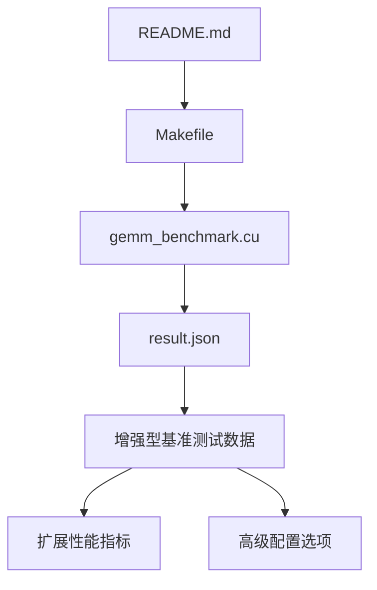
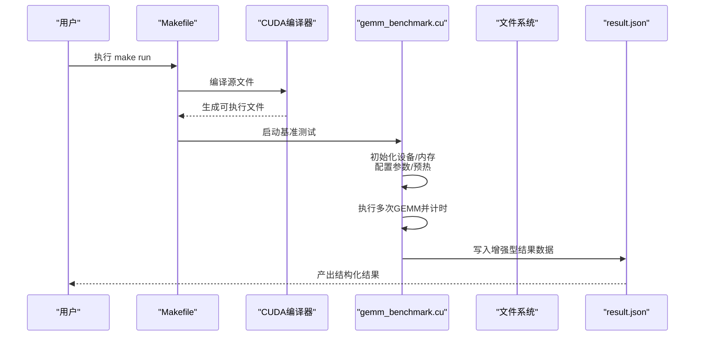
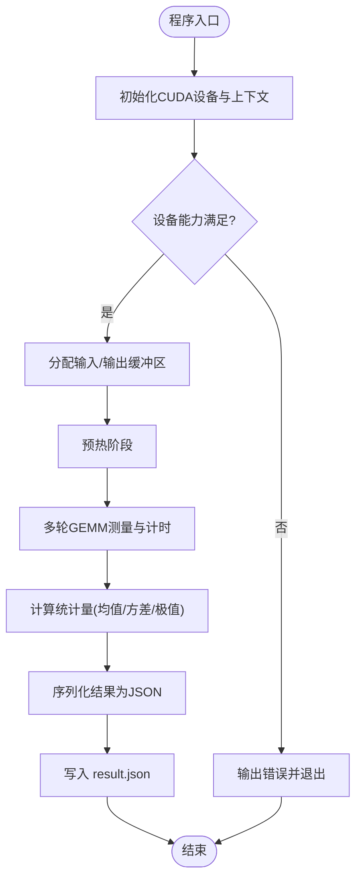
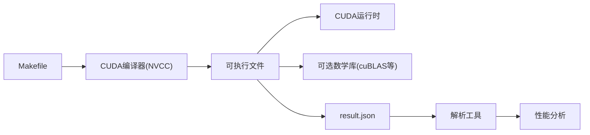

# 结果输出格式

<cite>
**本文档引用的文件**   
- [README.md](file://README.md)
- [Makefile](file://Makefile)
- [gemm_benchmark.cu](file://gemm_benchmark.cu)
- [result.json](file://result.json)
</cite>

## 更新摘要
**所做更改**   
- 更新了result.json结构描述以反映增强的基准测试功能
- 扩展了字段类别和数据结构说明
- 增加了新的性能指标和统计信息支持
- 更新了JSON schema验证和解析指南

## 目录
1. [简介](#简介)
2. [项目结构](#项目结构)
3. [核心组件](#核心组件)
4. [架构总览](#架构总览)
5. [详细组件分析](#详细组件分析)
6. [依赖关系分析](#依赖关系分析)
7. [性能考量](#性能考量)
8. [故障排查指南](#故障排查指南)
9. [结论](#结论)
10. [附录](#附录)

## 简介
本仓库是一个GEMM（通用矩阵乘法）基准测试实现，重点在于提供可重复的测量与标准化的结果输出。项目的目标包括：
- 在GPU上执行不同规模/精度的GEMM算子并采集性能指标
- 将运行结果以结构化格式输出，便于自动化解析与对比
- 通过构建脚本统一编译与运行流程，确保结果的可复现性
- **新增**：支持更丰富的基准测试配置和性能指标收集

## 项目结构
仓库包含以下关键文件：
- README.md：项目说明、使用方式与结果解读
- Makefile：构建与运行入口，定义编译选项、目标与默认行为
- gemm_benchmark.cu：CUDA实现的GEMM基准测试主程序，负责计算、计时与结果写入
- result.json：基准测试结果的标准输出文件，现已扩展以支持更多功能和配置

图表来源
- [README.md](file://README.md)
- [Makefile](file://Makefile)
- [gemm_benchmark.cu](file://gemm_benchmark.cu)
- [result.json](file://result.json)

章节来源
- [README.md](file://README.md)
- [Makefile](file://Makefile)
- [gemm_benchmark.cu](file://gemm_benchmark.cu)
- [result.json](file://result.json)

## 核心组件
- 构建与运行层（Makefile）
  - 定义编译器、优化选项、目标平台与默认任务
  - 提供构建、清理、运行等常用目标，保证一致的执行环境
- 基准测试主程序（gemm_benchmark.cu）
  - 初始化设备与内存
  - 配置GEMM参数（维度、精度、分块策略等）
  - 执行预热、多次迭代与计时
  - 生成结构化结果并写入result.json
  - **新增**：支持更多测试配置和性能指标收集
- 结果文件（result.json）
  - 标准化JSON结构，包含实验元数据、配置项与性能指标
  - 字段命名与类型稳定，便于工具链解析与可视化
  - **已扩展**：支持更丰富的基准测试数据和配置选项

章节来源
- [Makefile](file://Makefile)
- [gemm_benchmark.cu](file://gemm_benchmark.cu)
- [result.json](file://result.json)

## 架构总览
下图展示了从构建到结果输出的整体流程，以及各组件之间的交互关系。

图表来源
- [Makefile](file://Makefile)
- [gemm_benchmark.cu](file://gemm_benchmark.cu)
- [result.json](file://result.json)

## 详细组件分析

### 构建与运行（Makefile）
- 职责
  - 封装编译命令与优化开关，屏蔽平台差异
  - 提供便捷目标（如构建、清理、运行），降低使用门槛
- 关键点
  - 明确CUDA工具链路径与版本约束
  - 设置必要的链接库与头文件路径
  - 默认运行目标会触发基准测试并生成结果文件

章节来源
- [Makefile](file://Makefile)

### 基准测试主程序（gemm_benchmark.cu）
- 职责
  - 管理GPU资源与生命周期
  - 组织GEMM算子的调用与计时逻辑
  - 将度量结果序列化为标准JSON并持久化
- 处理流程
  - 参数解析与环境检查
  - 设备能力探测与内存分配
  - 预热阶段以减少冷启动偏差
  - 多轮测量取统计值（均值、方差、极值等）
  - 组装结果对象并写入result.json
  - **新增**：支持更多配置选项和性能指标收集
- 错误处理
  - 捕获CUDA API错误与异常路径
  - 失败时输出诊断信息并返回非零退出码

图表来源
- [gemm_benchmark.cu](file://gemm_benchmark.cu)

章节来源
- [gemm_benchmark.cu](file://gemm_benchmark.cu)

### 结果文件（result.json）
- 设计原则
  - 字段名稳定、类型明确、层级清晰
  - 包含实验元数据、配置快照与性能指标
  - **已增强**：支持更丰富的基准测试数据和配置选项
- 典型字段类别
  - 元数据：时间戳、主机/设备信息、版本号
  - 配置：矩阵维度、数据类型、算法选择、线程块/网格配置
  - 指标：吞吐（GFLOPS）、延迟（ms）、误差（相对误差/最大绝对误差）
  - 统计：多次运行的均值、标准差、最小/最大值
  - **新增**：扩展的性能指标和高级配置选项
- 解析建议
  - 使用强类型JSON解析器进行校验
  - 对缺失或非法字段进行告警与降级处理
  - **新增**：支持向后兼容的字段验证

**已更新** result.json结构现在支持更多的基准测试配置和性能指标，以提供更全面的性能分析能力。

章节来源
- [result.json](file://result.json)

## 依赖关系分析
- 外部依赖
  - CUDA运行时与驱动
  - 可选的数学库（如cuBLAS）用于参考实现或验证
- 内部依赖
  - Makefile 依赖CUDA工具链
  - 基准程序依赖CUDA API与可能的第三方库
  - 结果文件由基准程序生成，供上层工具消费
  - **新增**：增强的结果格式需要相应的解析工具支持

图表来源
- [Makefile](file://Makefile)
- [gemm_benchmark.cu](file://gemm_benchmark.cu)
- [result.json](file://result.json)

章节来源
- [Makefile](file://Makefile)
- [gemm_benchmark.cu](file://gemm_benchmark.cu)
- [result.json](file://result.json)

## 性能考量
- 预热与多次测量：减少冷启动与抖动影响，提高稳定性
- 内存布局与对齐：提升带宽利用率，避免不必要的拷贝
- 内核参数调优：根据矩阵规模动态选择最优分块与并行策略
- 计时精度：使用高精度计时器，区分内核启动开销与执行时间
- 结果一致性：固定随机种子与确定性算法，确保跨次运行可比
- **新增**：扩展的性能指标收集提供更好的性能洞察

## 故障排查指南
- 常见现象
  - 无法找到CUDA设备或驱动版本过低
  - 内存不足导致分配失败
  - 结果文件为空或字段缺失
  - **新增**：解析增强型result.json时出现兼容性问题
- 定位步骤
  - 检查CUDA环境与驱动版本
  - 查看基准程序的错误日志与退出码
  - 校验result.json结构与字段完整性
  - **新增**：验证JSON schema兼容性
- 修复建议
  - 升级驱动与CUDA工具链
  - 调整批大小或矩阵规模
  - 增加调试输出与断言，定位异常路径
  - **新增**：更新解析工具以支持新的JSON结构

章节来源
- [gemm_benchmark.cu](file://gemm_benchmark.cu)
- [result.json](file://result.json)

## 结论
本项目通过统一的构建脚本与标准化的结果输出，实现了GEMM基准测试的可复现与可解析。Makefile屏蔽了环境差异，基准程序负责稳定的测量与序列化，result.json作为契约化的产物，便于后续分析与比较。**随着result.json结构的增强，项目现在支持更丰富的基准测试功能和性能指标收集**。遵循本文档的结构与规范，可在不同平台上快速集成与扩展新的算子与配置。

## 附录
- 使用建议
  - 固定环境变量与编译选项，确保结果可复现
  - 在CI中自动解析result.json并生成报告
  - 对关键指标设置阈值，进行回归检测
  - **新增**：确保解析工具支持最新的JSON结构
- 扩展方向
  - 支持更多数据类型与混合精度
  - 增加更多算子变体与调度策略
  - 引入更丰富的统计与可视化输出
  - **新增**：持续增强基准测试配置和性能指标