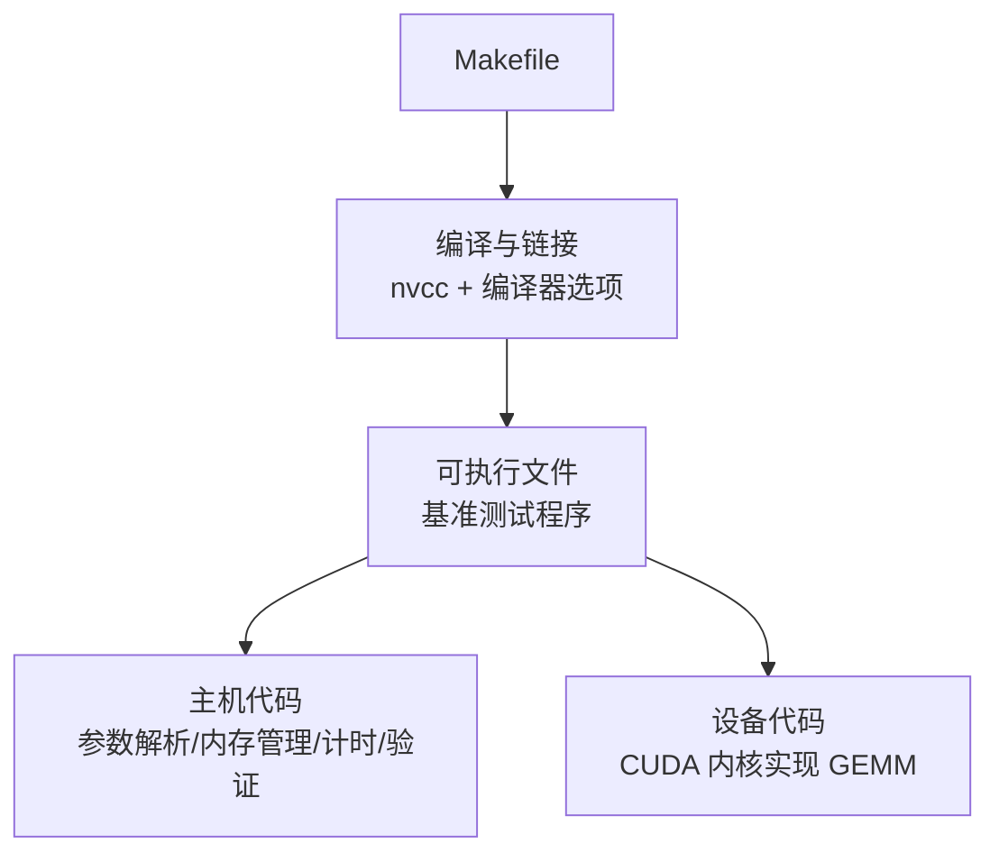
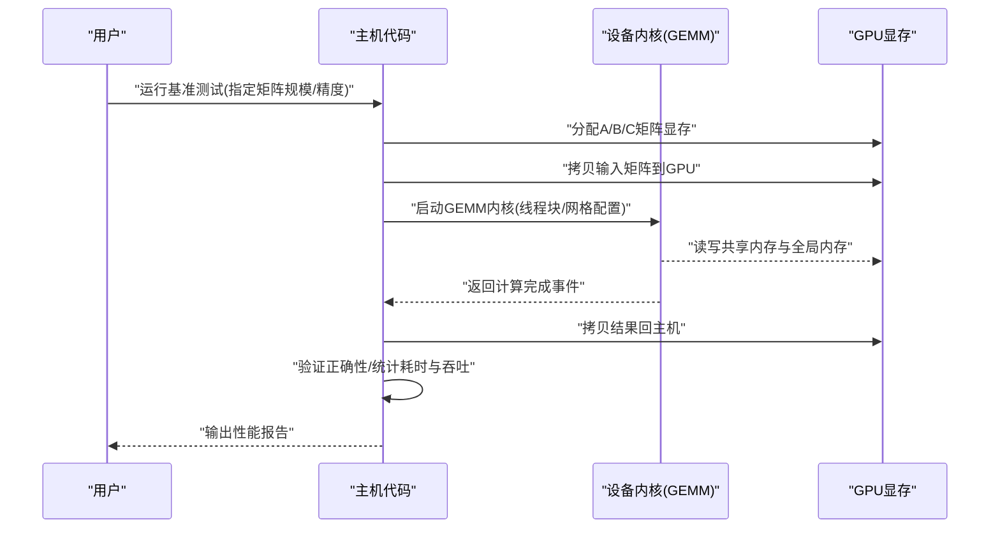
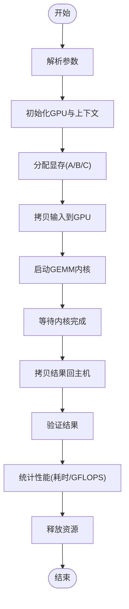
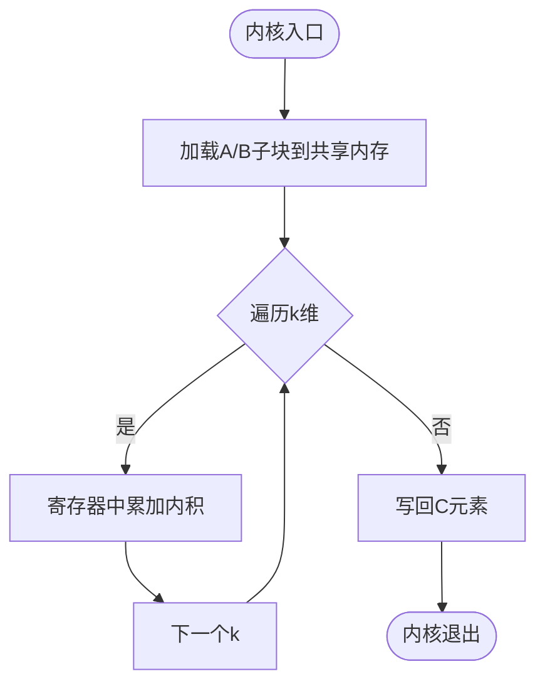
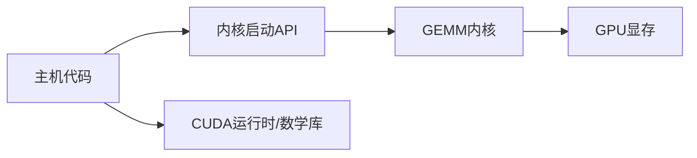

# 项目概述

<cite>
**本文引用的文件**   
- [Makefile](file://Makefile)
- [gemm_benchmark.cu](file://gemm_benchmark.cu)
</cite>

## 目录
1. [简介](#简介)
2. [项目结构](#项目结构)
3. [核心组件](#核心组件)
4. [架构总览](#架构总览)
5. [详细组件分析](#详细组件分析)
6. [依赖关系分析](#依赖关系分析)
7. [性能考量](#性能考量)
8. [故障排查指南](#故障排查指南)
9. [结论](#结论)
10. [附录：快速开始](#附录快速开始)

## 简介
本项目是一个基于 CUDA 的 GEMM（通用矩阵乘法）基准测试工具，旨在在 GPU 上对大规模矩阵乘法的性能进行测量与评估。GEMM 是高性能计算中的核心原语，广泛应用于深度学习训练/推理、科学计算（如线性代数求解器）、图形处理与信号处理等场景。通过利用 CUDA 的并行计算能力，该项目展示了如何在 GPU 上高效组织线程块与内存访问，以最大化吞吐并降低延迟。

本项目的目标读者包括：
- 初学者：了解 GEMM 的基本概念、CUDA 编程模型以及如何使用该基准工具。
- 有经验的开发者：理解内核设计思路、内存层次优化策略与性能调优要点。

## 项目结构
仓库采用极简结构，包含构建脚本与 CUDA 源文件：
- Makefile：定义编译选项、目标平台与运行命令，便于一键构建与执行。
- gemm_benchmark.cu：实现主机端控制流程与设备端 CUDA 内核，完成矩阵生成、内存分配、内核启动、结果验证与计时统计。

**图示来源** 
- [Makefile](file://Makefile)
- [gemm_benchmark.cu](file://gemm_benchmark.cu)

**章节来源**
- [Makefile](file://Makefile)
- [gemm_benchmark.cu](file://gemm_benchmark.cu)

## 核心组件
- 主机端控制流
  - 负责命令行参数解析、GPU 环境探测、输入矩阵初始化、显存分配与拷贝、内核启动配置、结果校验与性能统计。
- 设备端内核
  - 实现 GEMM 的核心计算逻辑，通常采用分块（tiling/blocking）策略，结合共享内存与寄存器重排，减少全局内存访问次数，提升带宽利用率。
- 构建系统
  - Makefile 封装 nvcc 编译流程，统一优化等级、架构目标与调试开关，确保跨平台一致性与可重复性。

**章节来源**
- [gemm_benchmark.cu](file://gemm_benchmark.cu)
- [Makefile](file://Makefile)

## 架构总览
整体采用“主机-设备”分离模式：
- 主机侧（CPU）：编排任务、管理数据生命周期、收集指标。
- 设备侧（GPU）：执行高并发矩阵乘法内核，充分利用多核与内存层次。

**图示来源** 
- [gemm_benchmark.cu](file://gemm_benchmark.cu)

## 详细组件分析

### 主机端控制流
- 功能要点
  - 参数解析：支持矩阵维度、数据类型、批次数、迭代次数等。
  - 资源管理：显存分配、主机-设备数据传输、错误检查。
  - 计时与统计：使用高精度计时器统计内核执行时间，计算 GFLOPS。
  - 结果验证：与参考实现或理论值对比，保证数值正确性。
- 关键流程
  - 初始化 → 分配/填充 → 启动内核 → 同步 → 拷贝回主机 → 验证 → 统计 → 释放资源。

**图示来源** 
- [gemm_benchmark.cu](file://gemm_benchmark.cu)

**章节来源**
- [gemm_benchmark.cu](file://gemm_benchmark.cu)

### 设备端内核（GEMM）
- 设计要点
  - 分块策略：将大矩阵划分为若干子块，加载至共享内存以减少全局内存访问。
  - 线程映射：每个线程计算结果矩阵的一个元素或一小片区域，按行/列方向协作。
  - 内存访问优化：合并访问、避免 bank conflict、合理使用寄存器缓存。
  - 数值稳定性：根据数据类型选择累加精度（如 FP32/FP64），必要时引入 Kahan 求和等技巧。
- 典型实现路径
  - 加载 A/B 子块 → 逐步累加内积 → 写回 C 对应位置 → 同步共享内存 → 下一块。

**图示来源** 
- [gemm_benchmark.cu](file://gemm_benchmark.cu)

**章节来源**
- [gemm_benchmark.cu](file://gemm_benchmark.cu)

### 构建系统（Makefile）
- 作用
  - 封装 nvcc 编译命令，设置目标架构、优化等级、调试符号与链接库。
  - 提供默认目标与清理规则，简化开发与回归测试流程。
- 建议
  - 针对不同 GPU 架构设置合适的 compute/arch 标志。
  - 在发布版本启用最高优化等级，并在调试版本保留符号信息。

**章节来源**
- [Makefile](file://Makefile)

## 依赖关系分析
- 内部依赖
  - 主机代码依赖设备内核提供的计算接口；内核依赖显存布局约定（行优先/列优先）。
- 外部依赖
  - CUDA 运行时库、标准数学库（可选）、计时与随机数库（用于生成测试矩阵）。
- 耦合度
  - 主机与设备通过明确的 API 边界解耦，便于替换不同内核实现或扩展新数据类型。

**图示来源** 
- [gemm_benchmark.cu](file://gemm_benchmark.cu)
- [Makefile](file://Makefile)

**章节来源**
- [gemm_benchmark.cu](file://gemm_benchmark.cu)
- [Makefile](file://Makefile)

## 性能考量
- 内存带宽瓶颈
  - GEMM 通常为带宽受限型操作，需通过分块与共享内存提高访存效率。
- 线程束（warp）效率
  - 确保内存访问合并、避免分支发散，最大化 warp 级并行。
- 流水线与重叠
  - 使用异步拷贝与多流技术隐藏延迟（在更复杂项目中）。
- 精度与吞吐权衡
  - FP16/TF32/FP64 的选择影响吞吐与数值精度，需根据应用场景平衡。
- 测量方法学
  - 预热内核、多次迭代取稳定值、排除 I/O 与同步开销，确保统计可靠。

[本节为通用指导，不直接分析具体文件]

## 故障排查指南
- 常见编译问题
  - 未安装 CUDA 工具链或版本不匹配；Makefile 中架构标志与实际 GPU 不符。
- 运行时错误
  - 显存不足：减小矩阵规模或批次大小；检查是否存在内存泄漏。
  - 内核崩溃：检查线程块/网格尺寸是否越界，共享内存索引是否正确。
- 性能异常
  - 未启用优化等级；未预热导致首测偏慢；I/O 混入计时区间。
- 结果不正确
  - 数据类型溢出或精度不足；累加顺序不一致导致数值差异；边界条件处理遗漏。

**章节来源**
- [gemm_benchmark.cu](file://gemm_benchmark.cu)
- [Makefile](file://Makefile)

## 结论
本项目提供了一个简洁而高效的 CUDA GEMM 基准测试框架，既适合教学演示，也便于工程化集成与性能回归。通过合理的主机-设备分工、内存层次优化与严谨的测量方法，能够在多种 GPU 平台上获得可靠的性能数据。后续可扩展点包括：多精度支持、自动内核搜索、多流并行与更丰富的可视化报告。

[本节为总结性内容，不直接分析具体文件]

## 附录：快速开始
- 前置要求
  - 已安装 CUDA Toolkit 与兼容的 GPU。
  - 系统中存在 nvcc 编译器。
- 构建与运行
  - 在项目根目录执行构建命令（由 Makefile 提供）。
  - 运行生成的可执行文件，传入矩阵规模与精度等参数。
- 预期输出
  - 打印内核执行时间、GFLOPS、内存带宽利用率与正确性校验结果。
- 常见问题
  - 若出现编译错误，请检查 CUDA 版本与 Makefile 中的架构标志。
  - 若性能偏低，尝试调整线程块大小或启用更高优化等级。

**章节来源**
- [Makefile](file://Makefile)
- [gemm_benchmark.cu](file://gemm_benchmark.cu)